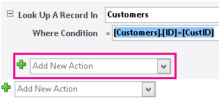
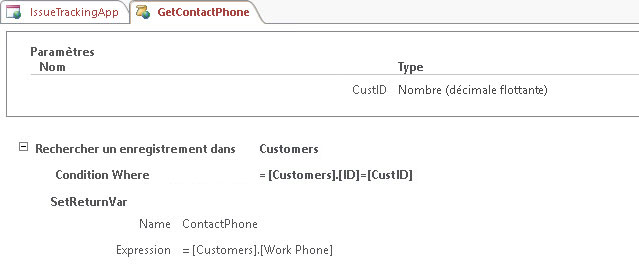

# Création et personnalisation d’une application web dans Access

> [!IMPORTANT]
> Microsoft ne recommande plus la création et l'utilisation d'applications web Access dans SharePoint. En guise d'alternative, vous pouvez utiliser [Microsoft PowerApps](https://powerapps.microsoft.com/fr-FR/) pour générer des solutions d'entreprise sans code pour le web et les appareils mobiles. 
  
Access 2013 propose un nouveau modèle d'application qui permet aux experts de créer rapidement des applications pour le web. Access inclut un ensemble de modèles qui vous permettent de commencer à créer votre application.

## Conditions préalables à la création d'une application avec Access 2013

Pour suivre les étapes de cet exemple, vous avez besoin des éléments suivants :
  
- Access
    
- Un environnement de développement SharePoint
    
Pour plus d'informations sur la configuration de votre environnement de développement SharePoint, consultez [Configurer un environnement de développement général pour SharePoint](https://docs.microsoft.com/fr-FR/sharepoint/dev/general-development/set-up-a-general-development-environment-for-sharepoint). 
  
Pour plus d'informations sur l'obtention d’Access et SharePoint, consultez [Téléchargements](http://msdn.microsoft.com/fr-FR/office/apps/fp123627).

## Création de l'application

Supposons que vous vouliez créer une application Access qui assure le suivi des problèmes pour votre entreprise. Avant de commencer à créer les tables et affichages à partir de rien, vous devriez rechercher un modèle de schéma correspondant à vos besoins.
  
### Pour créer l'application de suivi des problèmes

1. Ouvrez Access, puis sélectionnez **Application web personnalisée**.
    
2. Entrez un nom et un emplacement web pour votre application. Vous pouvez également sélectionner un emplacement dans la liste **Emplacements**, puis sélectionner **Créer**.
    
3. Dans le champ **Quels sont les éléments dont vous souhaitez effectuer le suivi ?**, entrez **Problèmes**, puis appuyez sur Entrée. 
    
   La figure 1 présente la liste des modèles pouvant être utiles pour le suivi des problèmes.
    
   **Figure 1. Modèles appropriés pour la recherche des problèmes**

   
  
4. Sélectionnez **Problèmes**.
    
Access crée un ensemble de tables et d'affichages.
  
## Exploration de l'application

Pour savoir si le schéma et les affichages répondent à vos besoins, vous devez les examiner.
  
Les tables créées en sélectionnant le schéma Problèmes s'affichent dans le volet en mosaïque. Les tables Problèmes, Clients et Employés constituent la cible principale de l'application. La table Problèmes stocke des informations sur chaque problème. Chaque problème est attribué à l'employé qui l'ouvre au nom d'un client. Les tables Problèmes connexes et Commentaires sur le problème jouent un rôle de soutien dans l'application. La table Problèmes connexes vous permet de lier des problèmes. La table Commentaires sur le problème stocke plusieurs commentaires pour un même problème.
  
Dans une base de données du bureau Access (.accdb), les relations entre tables sont gérées dans la fenêtre **Relations**. Les applications Access 2013 gèrent les relations à l'aide de champs définis pour le type de données **Recherche**. Examinons les relations pour la table Problèmes en cliquant avec le bouton droit sur l'élément de mosaïque **Problèmes**, puis en sélectionnant **Modifier la table**.
  
Le champ **Client** est associé à la table **Clients**. Pour examiner la relation, sélectionnez le champ **Client**, puis **Modifier les listes de choix**. L' **Assistant Liste de choix** s'affiche comme illustré à la figure 2. 
  
**Figure 2. Assistant Liste de choix affichant la relation à la table Clients**

  
La boîte de dialogue de l'Assistant Liste de choix indique que le champ **Client** est lié à la table **Clients**, et invite à revenir au champ **Nom complet Prénom Nom** de la table **Clients**. 
  
Les champs **Ouvert par**, **Affecté à** et **Modifié par** ont trait à la table **Employés**. Plusieurs autres champs sont également définis pour le type de données **Recherche**. Dans ces cas, celui-ci est utilisé pour spécifier les valeurs à autoriser pour ce champ. 
  
Fermez la table **Problèmes**, puis examinez le volet des mosaïques. Les trois mosaïques supérieures pour les tables **Problèmes**, **Clients** et **Employés** s'affichent différemment des deux mosaïques inférieures pour les tables **Problèmes connexes** et **Commentaires sur le problème**, comme l'illustre la figure 3. 
  
**Figure 3. Volet des mosaïques pour le schéma Problèmes**

  
Les tables **Problèmes connexes** et **Commentaires sur le problème** sont grisées parce qu'elles devront être invisibles pour l'utilisateur dans le navigateur web. 
  
Utilisons l'application pour suivre certains problèmes. À cette fin, cliquez sur **Démarrer l'application** pour ouvrir l'application dans votre navigateur Web. 
  
L'application ouvre l'affichage **Liste des problèmes** de la table Problèmes. Avant d'ajouter un problème, il est recommande d'ajouter des clients et employés. Pour commencer à ajouter des clients, cliquez sur la mosaïque **Clients**. 
  
Utilisez le Sélecteur d'affichage pour choisir l'un des trois modes d'affichage disponibles pour la table **Clients**, à savoir **Liste**, **Feuille de données** ou **Groupes**, comme illustré à la figure 4. 
  
**Figure 4. Sélecteur d’affichage**

  
Le choix du mode **Liste** active l'affichage **Liste des clients**, qui est un affichage de type Détails de la liste. L'affichage Détails de la liste est l'un de ceux qu'Access génère automatiquement lors de la création d'une table. Le principal élément qui caractérise un affichage Détails de la liste est le volet Liste du côté gauche de l'affichage. Ce volet permet de filtrer et de parcourir les enregistrements figurant dans l'affichage. Dans une base de données du Bureau Access , l'implémentation d'un affichage Liste permettant d'effectuer une recherche requiert l'écriture d'un code personnalisé. 
  
Le choix du mode **Feuille de données** ouvre l'affichage **Feuille de données clients**. La feuille de données est l'autre type d'affichage qu'Access génère automatiquement lors de la création d'une table. L'affichage Feuille de données est utile pour ceux qui trouvent plus facile d'entrer, de trier et de filtrer des données comme ils le font dans une feuille de calcul. 
  
Le choix du mode Groupes ouvre un Affichage de synthèse. Ce type d'affichage permet de regrouper des enregistrements sur la base d'un champ, et d'éventuellement calculer une somme ou une moyenne.
  
Lors de l'ajout de clients, utilisez la barre d'action pour ajouter, modifier, rétablir, enregistrer ou supprimer des enregistrements. La barre d'action est une barre d'outils personnalisable qui s'affiche en haut de chaque affichage, comme l'illustre la figure 5.
  
**Figure 5. Barre d’action**

  
Après avoir ajouté des clients et des employés, ouvrez l'affichage Liste des problèmes, puis commencez à ajouter un problème. À mesure que vous tapez le nom d'un client dans le champ Client, un ou plusieurs noms de client s'affichent, comme l'illustre la figure 6.
  
**Figure 6. Contrôle de saisie semi-automatique**

  
Le champ Client est un contrôle de saisie semi-automatique. Ce contrôle affiche la liste des enregistrements correspondant à ce que vous tapez dans le champ. Cela vous aide à contrôler l'exactitude des données que vous entrez.
  
## Personnalisation de l'application

Après avoir examiné l'application, vous constatez que l'affichage Liste des problèmes ne contient pas d'information de contact pour le client. Personnalisons l'application pour ajouter le numéro de téléphone professionnel du client à la table Problème lors de la création d'un problème.
  
### Pour ajouter un champ à la table Problèmes

1. Ouvrez l'application dans Access.
    
2. Sélectionnez la mosaïque **Problèmes**, l'icône **Paramètres/Action**, puis **Modifier la table**.
    
3. Entrez les **Coordonnées du contact** dans la première cellule vide de la colonne **Nom de champ**. 
    
4. Sélectionnez **Texte court** dans la colonne **Type de données**. 
    
5. Cliquez sur **Enregistrer**.
    
6. Fermez la table Problèmes.
    
À présent que nous avons un champ dans lequel enregistrer le numéro de téléphone, créons une macro de données pour rechercher les informations de contact.
  
### Pour créer la macro de données recherchant des informations de contact

1. Dans le groupe **Créer**, sélectionnez **Avancé**, puis **Macro de données**.
    
2. Sélectionnez **Créer un paramètre**.
    
3. Dans le champ **Nom**, entrez **CustID**. Dans la liste déroulante **Type**, sélectionnez **Nombre (décimale flottante).**
    
4. Dans la liste déroulante **Ajouter une nouvelle action**, sélectionnez **LookupRecord**. 
    
5. Dans la liste déroulante **Rechercher un enregistrement dans**, sélectionnez **Clients**. 
    
6. Dans le champ **Condition Where**, entrez **[Customers].[ID]=[CustID]**. 
    
7. Dans la liste déroulante **Ajouter une nouvelle Action**, sélectionnez **SetReturnVar**. 
    
    > [!NOTE]
    > Vous verrez deux listes déroulantes **Ajouter une nouvelle Action**, une au sein du bloc **LookupRecord** et une autre extérieure au bloc **LookupRecord**. Vous devez sélectionner la liste déroulante **Ajouter une nouvelle Action** dans le bloc **LookupRecord**, comme illustré dans la Figure 7. 
  
   **Figure 7. Liste déroulante Ajouter une nouvelle Action**

   
  
8. Dans le champ **Nom**, entrez **TéléphoneContact**. 
    
9. Dans le champ **Expression**, entrez **[Customers].[Work Phone]**. 
    
10. Sélectionnez **Enregistrer**. Dans le champ **Nom de macro**, entrez **ObtenirTéléphoneContact**, puis sélectionnez **OK**.
    
    La macro doit ressembler celle illustrée à la figure 8.
    
    **Figure 8. Macro de données ObtenirTéléphoneContact**

    
  
11. Fermez l'affichage Création de macros.
    
À présent, nous sommes prêts à ajouter le champ **Coordonnées du contact** au formulaire Liste des problèmes. 
  
### Pour ajouter le champ Coordonnées du contact au formulaire Liste des problèmes

1. Sélectionnez la table **Problèmes**. Cette action sélectionne le formulaire Liste des problèmes. 
    
2. Dans le sélecteur d'affichage, sélectionnez **Liste**, l'icône **Paramètres/Action**, puis **Modifier**.
    
3. Faites glisser le champ **Cordonnées du contact** du volet **Liste de champs** vers l'emplacement du formulaire où vous voulez que le numéro de contact s'affiche. 
    
4. Activez la case à cocher **Coordonnées du contact**, puis cliquez sur **Données**. 
    
5. Dans le champ **Nom du contrôle**, entrez **ContactClient**, puis fermez la fenêtre contextuelle **Données**. 
    
6. Cliquez sur **Enregistrer**.
    
À présent, nous devons écrire une macro d'interface utilisateur qui copie le champ **Téléphone professionnel** de la table **Clients** vers le champ **Téléphone du contact** de la table **Problèmes**. L'événement **Après la mise à jour** du contrôle **CustomerAutocomplete** est un bon emplacement pour enregistrer la macro. 
  
### Pour créer la macro AprèsMiseàJour

1. Sélectionnez le contrôle **CustomerAutocomplete**, le bouton **Actions**, puis **Après la mise à jour**. 
    
    Une macro vide s'ouvre dans l'affichage Création de macros.
    
2. Dans la liste déroulante **Ajouter une nouvelle action**, sélectionnez **ExécuterMacroDonnées**. 
    
3. Dans la liste déroulante **Nom de la macro**, sélectionnez **ObtenirTéléphoneContact**. 
    
4. Dans le champ **CustID**, entrez **[CustomerAutocomplete]**. 
    
5. Dans le champ **DéfinirVarLocale**, entrez **Téléphone**. 
    
    Après sélection de la macro de données ObtenirTéléphoneContact créée précédemment, Access a automatiquement complété le nom du paramètre et renvoie une variable pour la macro.
    
    Le numéro de téléphone du client est stocké dans une variable nommée Téléphone.
    
6. Dans la liste déroulante **Ajouter une nouvelle action**, sélectionnez **DéfinirPropriété**. 
    
7. Dans le champ **Nom du contrôle**, entrez **ContactClient**. 
    
8. Dans la liste déroulante **Propriété**, sélectionnez **Valeur**. 
    
9. Dans le champ **Valeur**, entrez **=[Phone]**. 
    
10. Cliquez sur **Enregistrer**.
    
    La macro doit ressembler celle illustrée à la figure 9.
    
    **Figure 9. Après la Mise à jour de macros**

    
  
11. Fermez l'affichage Création de macros.
    
12. Fermez l'affichage Liste des problèmes. Lorsque vous êtes invité à enregistrer vos modifications, sélectionnez **Oui**. 
    
À présent, nous sommes prêts pour la personnalisation du texte. Cliquez sur **Lancer l’application** pour ouvrir l’application dans votre navigateur web et ajoutez un problème. Le champ **Coordonnées du contact** est automatiquement mis à jour après la saisie du nom du client, comme illustré à la figure 10. 
  
**Figure 10. Affichage Problèmes mis à jour avec un numéro de téléphone**

  
## Conclusion

L'utilisation d'un des modèles de schéma inclus dans est une bonne manière de commencer à créer une application web Access. Les affichages créés automatiquement pour vous contiennent des fonctionnalités avancées qui requièrent un code personnalisé à implémenter dans une base de données du Bureau Access. 
  
## Voir aussi

- [Nouveautés d’Access 2013 pour les développeurs](http://msdn.microsoft.com/library/df778f51-d65e-4c30-b618-65003ceb39b3%28Office.15%29.aspx) 
- [Référence de l'application web personnalisée Access](access-custom-web-app-reference.md)
  

