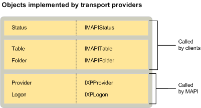

# Objets de fournisseur de transport MAPIMAPI transport provider objects
  
**S’applique à** : Outlook 2013 | Outlook 2016**Applies to**: Outlook 2013 | Outlook 2016 
  
Outre les objets fournisseur et d’accès standard implémentés par tous les fournisseurs de services, les fournisseurs de transport sont requis pour implémenter un objet d’état.In addition to the standard provider and logon objects implemented by all service providers, transport providers are required to implement a status object. Pour les autres types de fournisseurs de services, l’implémentation d’un objet d’état est facultative.For the other service provider types, implementing a status object is optional. Toutefois, MAPI l’exige pour les fournisseurs de transport.However, MAPI requires it for transport providers. Les fournisseurs de transport qui peuvent télécharger des en-têtes de message à partir d’un serveur distant implémentent également un dossier et une table.Transport providers that support the downloading of message headers from a remote server also implement a folder and a table. 
  
L’illustration suivante montre chacun des objets que les fournisseurs de transport peuvent implémenter avec leurs interfaces correspondantes.The following illustration shows each of the objects that transport providers can implement with their corresponding interfaces. L’illustration indique également si MAPI ou un client est l’utilisateur de l’objet.The illustration also indicates whether MAPI or a client is the object's user.
  
![Objets implémentant par les fournisseurs de transport]des objets(media/amapi_66.gif "implémentant par les fournisseurs de transport")
  
## Voir aussiSee also

- [Objets du fournisseur de services MAPIMAPI Service Provider Objects](mapi-service-provider-objects.md)

