# Sélection d'une API ou d'une technologie pour développer des solutions pour Outlook

Cet article décrit les API et technologies que vous pouvez utiliser pour étendre Outlook 2013 et vous aide à choisir l'API ou la technologie adaptée à votre scénario.
  
Microsoft prend en charge diverses API et technologies qui étendent Outlook : 
  
- Nouveauté dans Office 2013 : la plateforme d'applications pour Office offre des possibilités d'extension des fonctionnalités Outlook dans les clients Outlook sur ordinateur de bureau, tablette et smartphone. La plateforme comprend une interface API JavaScript pour Office et un schéma pour les manifestes d'application.
    
- Le modèle objet, l'assembly PIA (Primary Interop Assembly) d'Outlook correspondant et l'API de messagerie (MAPI) sont les API les plus couramment utilisées dans les solutions Outlook.
    
- Les API auxiliaires complètent MAPI dans certains scénarios.
    
- L'extensibilité du fournisseur Outlook Social Connector (OSC) et l'extensibilité de la barre météorologique sont utilisées dans des scénarios propres à leurs marchés ciblés.
    
Cet article explique les critères de sélection de la plateforme Compléments Office, du modèle objet, de l'assembly PIA et de MAPI. Compléments Office utilisent l'interface API JavaScript pour Office et n'appellent pas le modèle objet, et vice-versa. Les solutions qui utilisent d'autres API peuvent utiliser une ou plusieurs API. Par exemple, un complément COM écrit en C++ peut utiliser le modèle objet, MAPI et les API auxiliaires dans la même solution.
  
Pour profiter pleinement de cet article, vous devez connaître Outlook au niveau utilisateur et posséder des connaissances générales en matière de développement logiciel. Toutefois, il n'est pas nécessaire que vous maîtrisiez complètement toutes les fonctionnalités prises en charge par ces API ou technologies. L'article vous permet de répondre aux questions suivantes :
  
- Si vous avez seulement une idée des objectifs de votre solution, du marché cible et des ressources disponibles, de quels autres critères devez-vous tenir compte pour choisir une API ?
    
- Pourquoi envisageriez-vous d'utiliser les Compléments Office, et à quel moment choisiriez-vous de créer des applications au lieu de compléments ?
    
- Si votre solution doit être exécutée sur des versions antérieures d'Outlook, notamment Outlook 2003, en quoi cela a-t-il une incidence sur le choix de votre API ?
    
- Si votre solution doit itérer dans des dossiers Outlook qui contiennent des milliers d'éléments, et que vous devez pouvoir modifier ces derniers, quelle serait l'API la plus adaptée ?
    
- Si votre solution dépend significativement de la logique métier Outlook et interagit avec d'autres applications Office, le modèle objet Outlook est-il le meilleur choix ?
    
- Quels éléments le modèle objet et MAPI vous permettent-ils d'étendre dans Outlook ?
    
- Si vous pouvez utiliser le modèle objet ou MAPI pour effectuer votre tâche, comment décider de l'API à utiliser ?
    
## Critères d'évaluation objectifs

Cette section décrit les critères que vous pouvez utiliser pour comparer la plateforme des Compléments Office, le modèle objet, l'assembly PIA et MAPI pour déterminer lequel correspond le mieux à vos besoins. Les différents critères peuvent avoir plus ou moins d'importance, en fonction de vos projets et des ressources disponibles.
  
Les tableaux de cette section définissent les critères d'évaluation dans les catégories suivantes :
  
- Critères fonctionnels : décrit les opérations que vous pouvez et ne pouvez pas effectuer avec la technologie.
    
- Critères de développement : décrit les outils de développement ou les informations nécessaires pour utiliser la technologie.
    
- Critères de sécurité : décrit les problèmes de sécurité et d'autorisations liés à la technologie.
    
- Critères de déploiement : décrit les méthodes de déploiement et de distribution recommandées pour la technologie.
    
### Critères d'évaluation objectifs pour la plateforme des applications pour Office

Depuis la version Office 2013, les développeurs peuvent utiliser la plateforme des Compléments Office afin d'étendre le contenu et les services web dans le contexte de clients riches et web Office. Une Complément Office est une page web développée à l'aide des technologies web courantes, hébergée dans une application cliente Office (telle qu'Outlook) et qui peut être exécutée en local ou dans le cloud. Parmi les quelques types d'Compléments Office, celui pris en charge par Outlook est nommé applications de messagerie. Si le modèle objet, l'assembly PIA et MAPI sont souvent utilisés pour automatiser Outlook au niveau de l'application, vous pouvez utiliser l'interface API JavaScript pour Office afin d'interagir à un niveau d'élément avec le contenu et les propriétés du message électronique, de la demande de réunion ou du rendez-vous. Vous pouvez publier des applications de messagerie dans l'Office Store ou un catalogue Exchange interne. 
  
Les utilisateurs finals et les administrateurs peuvent installer des applications de messagerie sur une boîte aux lettres Exchange et les utiliser dans le client riche Outlook, ainsi que dans Outlook Web App. En tant que développeur, vous pouvez choisir de rendre votre application de messagerie disponible uniquement sur ordinateur de bureau, ou également sur tablette et smartphone. La figure 1 montre un exemple d'une application de messagerie YouTube, qui est décrite en détail dans l'article [Exemple : Créer une application de messagerie pour visualiser des vidéos YouTube dans Outlook](http://msdn.microsoft.com/library/bfde1d24-2c13-4798-9b13-5f307d49370f%28Office.15%29.aspx). Cette application de messagerie permet aux utilisateurs finals de sélectionner l'URL d'une vidéo YouTube et de regarder la vidéo dans Outlook ou Outlook Web App sur ordinateur de bureau ou tablette.
  
**Figure 1. L'application de messagerie YouTube est active pour le message sélectionné, qui contient une URL vers une vidéo sur YouTube.com**

  
Après avoir été installée, l'application de messagerie peut être utilisée dans la barre de l'application lorsque le contexte actuel correspond aux conditions d'activation spécifiées par cette dernière. Une application de messagerie vous permet d'indiquer des règles concernant l'élément actuellement sélectionné qui active une application de messagerie dans certaines conditions uniquement. Par exemple, l'application de messagerie YouTube, qui vous permet de lire une vidéo YouTube dans Outlook est utile uniquement lorsque l'élément Outlook sélectionné contient une URL vers une vidéo sur YouTube.com. Dans ce cas, vous devez indiquer que l'application doit être active uniquement lorsque le message sélectionné contient une URL de ce type.
  
Les tableaux suivants présentent les critères d'évaluation de la plateforme des Compléments Office.
  
#### Critères fonctionnels

|**Critères**|**Prise en charge des applications de messagerie dans la plateforme des applications pour Office**|
|:-----|:-----|
|Domaine d'application    |L'étendue d'activité d'une application de messagerie comporte pratiquement tout élément de message ou de rendez-vous pris en charge dans la boîte aux lettres Exchange sélectionnée par l'utilisateur et qui remplit les conditions d'activation. Les autorisations d'une application de messagerie déterminent son accès aux propriétés et entités spécifiques (telles qu'une adresse électronique ou un numéro de téléphone) existantes pour cet élément. Par exemple, une application de messagerie demandant l'autorisation **boîte aux lettres en lecture-écriture** peut lire et écrire toutes les propriétés de tout élément figurant dans la boîte aux lettres de l'utilisateur ; créer, lire et écrire dans tout dossier ou élément ; et envoyer un élément à partir de cette boîte aux lettres.    |
|Objets principaux    |L'interface API JavaScript pour Office fournit quelques objets au niveau supérieur partagés par tous les types d'Compléments Office : [Office](http://msdn.microsoft.com/library/c490b13d-ee52-4291-af5d-f4a5a11d3af0%28Office.15%29.aspx), [Context](http://msdn.microsoft.com/library/662883d5-b86f-4bdc-99f0-9ee9129ed16c%28Office.15%29.aspx) et [AysncResult](http://msdn.microsoft.com/library/540c114f-0398-425c-baf3-7363f2f6bc47%28Office.15%29.aspx). Le prochain niveau dans l'API applicable et propre aux applications de messagerie comprend les objets [Mailbox](http://msdn.microsoft.com/library/a3880d3b-8a09-4cf9-9274-f2682cb3b769%28Office.15%29.aspx), [Item](http://msdn.microsoft.com/library/ad288df1-3ca2-474c-bea4-c51f46e6fc43%28Office.15%29.aspx) et [UserProfile](http://msdn.microsoft.com/library/6d0a36ec-0d5c-40e3-9f6f-9a7fcf0ac3d8%28Office.15%29.aspx), qui prennent en charge l'accès aux informations relatives à l'utilisateur et à l'élément actuellement sélectionnés dans la boîte aux lettres de l'utilisateur. Au niveau des données, les objets [CustomProperties](http://msdn.microsoft.com/library/95a69bd6-c4dc-429a-8b27-e2b68f74f3e3%28Office.15%29.aspx) et [RoamingSettings](http://msdn.microsoft.com/library/cf21bb08-7274-4ad6-ae9e-b2c12f92abc9%28Office.15%29.aspx) prennent en charge les propriétés persistantes configurées par l'application de messagerie pour l'élément sélectionné et pour la boîte aux lettres de l'utilisateur, respectivement. Les objets de niveau élément comprennent les objets [Appointment](http://msdn.microsoft.com/library/08ebffff-eb52-4e21-9d4e-8f79e426f992%28Office.15%29.aspx) et [Message](http://msdn.microsoft.com/library/909ad9eb-a1bc-4caa-b51e-fd59a02b9569%28Office.15%29.aspx) qui héritent de l'objet **Item**, ainsi que l'objet [MeetingRequest](http://msdn.microsoft.com/library/c658fa3d-1138-4a67-9a4b-c9edd11f8385%28Office.15%29.aspx) qui hérite de l'objet **Message**. Ces objets représentent les types d'éléments Outlook qui prennent en charge les applications de messagerie : éléments de calendrier de rendez-vous et réunions, et éléments de message tels que les messages électroniques, les demandes de réunion, les réponses et les annulations. Au-delà de ce niveau dans l'API, il s'agit de propriétés de niveau élément (telles que [Appointment.subject](http://msdn.microsoft.com/library/ffa6812c-34b8-4b0a-8f92-22c3580c8379%28Office.15%29.aspx)), ainsi que d'objets et de propriétés qui prennent en charge certains objets [Entities](http://msdn.microsoft.com/library/1a06c8d1-dafe-46f4-967e-dd9b1d5b20e9%28Office.15%29.aspx) connus (par exemple [Contact](http://msdn.microsoft.com/library/2604b44c-7b79-47f0-ac3e-7d99bc9e6751%28Office.15%29.aspx), [MeetingSuggestion](http://msdn.microsoft.com/library/9726fbff-0f4f-4b70-8deb-effc14607d4e%28Office.15%29.aspx), [PhoneNumber](http://msdn.microsoft.com/library/cc86426a-2730-4774-9067-0611e5c8e9c1%28Office.15%29.aspx) et [TaskSuggestion](http://msdn.microsoft.com/library/16b0c3d6-adf4-4a88-ad09-4bb5565816b1%28Office.15%29.aspx)).    [Vue d'ensemble de l'architecture et des fonctionnalités des compléments Outlook](http://msdn.microsoft.com/library/2cd5641b-492b-4431-8388-7fc589163e9c%28Office.15%29.aspx) pour obtenir un résumé des fonctionnalités prises en charge pour les applications de messagerie.    |
|Modèle d'accès aux données    |L'interface API JavaScript pour Office représente les fonctionnalités suivantes sous la forme d'un ensemble hiérarchique d'objets : l'environnement d'exécution de l'application, la boîte aux lettres et le profil de l'utilisateur et les données relatives à un élément.    |
|Modèles de thread    |Chaque application de messagerie s'exécute dans son propre processus distinct du processus Outlook.    |
|Architectures d'application    |Dans Outlook, une application de messagerie est un ensemble de pages web HTML et JavaScript hébergées en tant que processus distinct dans un contrôle de navigateur web qui, à son tour, est hébergé dans un processus d'exécution d'application qui offre une séparation de la sécurité et des performances.    |
|Utilisation à distance    |Les applications de messagerie utilisent l'interface API JavaScript pour Office pour accéder aux données relatives à l'utilisateur actuel, à la boîte aux lettres et à l'élément sélectionné stocké sur le serveur Exchange Server correspondant. Si elles disposent des autorisations appropriées et qu'elles utilisent la technique appropriée pour l'accès inter-domaines, les applications de messagerie peuvent également appeler les services web Exchange, ainsi que d'autres services web tiers pour étendre leurs fonctionnalités.    |
|Transactions    |L'interface API JavaScript pour Office ne prend pas en charge les transactions.    |
|Disponibilité    |L'interface API JavaScript pour Office est disponible pour les boîtes aux lettres sur Exchange Server 2013, à partir de la version Outlook 2013.    |
   
#### Critères de développement

|**Critères**|**Prise en charge des applications de messagerie dans la plateforme des applications pour Office**|
|:-----|:-----|
|Langages et outils    |Vous pouvez implémenter des applications de messagerie à l'aide de n'importe quelle technologie web courante, notamment HTML5, JavaScript, CSS3, XML et les API REST. Vous pouvez utiliser votre outil de développement web par défaut. Vous pouvez également utiliser Outils de développement Office 365 « Napa », Visual Studio 2012 ou une version ultérieure de ces outils et bénéficier de leurs avantages pour gagner du temps dans votre développement.    |
|Implémentation managée    |Si nécessaire dans votre scénario, vous pouvez utiliser des pages .aspx managées pour implémenter du code sur le serveur pour vos applications de messagerie.    |
|Peut contenir des scripts    |L'interface API JavaScript pour Office est directement utilisée dans les scripts.    |
|Outils de test et de débogage    |Vous pouvez utiliser les outils de développement que vous préférez. Outils de développement Office 365 « Napa » et Visual Studio fournissent un environnement de développement intégré qui facilite le test et le débogage d'applications. [Résoudre les problèmes d'activation des compléments Outlook](http://msdn.microsoft.com/library/da5b56c9-7fd1-4556-8c0e-f489c4c9e9b6%28Office.15%29.aspx) et [Exemple : Propriétés de débogage des éléments Outlook](http://msdn.microsoft.com/library/e3f14f07-cf35-4896-aab0-cb7625ca09b5%28Office.15%29.aspx) vous offrent une aide supplémentaire concernant la résolution des problèmes et le débogage des applications de messagerie.    |
|Disponibilité des experts    |Il est assez aisé de trouver des programmeurs possédant le niveau requis d'expertise de développement web pour les Compléments Office. La plateforme est destinée aux développeurs professionnels et non professionnels.    |
|Informations disponibles    |Des informations relatives au développement et à la publication d'Compléments Office sont disponibles sur la page [Centre pour développeurs Office](http://msdn.microsoft.com/en-us/office/apps/fp160950.aspx). La page [Compléments Outlook](http://msdn.microsoft.com/library/71e64bc9-e347-4f5d-8948-0a47b5dd93e6%28Office.15%29.aspx) contient de la documentation spécifique concernant les applications de messagerie.    |
|Gestion des licences de développeur et de déploiement    |Reportez-vous à [Gérer les licences de compléments pour Office et SharePoint](http://msdn.microsoft.com/library/3e0e8ff6-66d6-44ff-b0c2-59108ebd9181%28Office.15%29.aspx) pour plus d'informations sur l'infrastructure de gestion de licences d'application pour les Compléments Office.    |
   
#### Critères de sécurité

|**Critères**|**Prise en charge des applications de messagerie dans la plateforme des applications pour Office**|
|:-----|:-----|
|Autorisations attribuées au moment de la conception    |Aucune autorisation spéciale n'est requise pour développer des applications de messagerie.    |
|Autorisations d'installation    |Par défaut, les utilisateurs finals et les administrateurs peuvent installer des applications de messagerie à faible niveau de confiance qui nécessitent l'autorisation **élément restreint** ou **élément lu**. Les administrateurs peuvent installer des applications de messagerie à niveau de confiance élevé qui nécessitent l'autorisation **boîte aux lettres en lecture-écriture**.      |
|Autorisations d'exécution    |Les applications de messagerie nécessitent un niveau d'autorisation spécifique fondé sur un modèle d'autorisations à trois niveaux : **élément restreint**, **élément lu** et **boîte aux lettres en lecture-écriture**.    |
|Fonctionnalités de sécurité intégrées    | L'exécution des Compléments Office offre les avantages suivants permettant d'empêcher qu'une application endommage l'environnement de l'utilisateur final :     Isole le processus dans lequel s'exécute l'application.     Ne nécessite pas de remplacements de .dll ou de .exe, ni de composants ActiveX.     Facilite l'installation ou la désinstallation des applications par l'utilisateur final.     L'administrateur et les utilisateurs finals contrôlent les applications de messagerie rendues disponibles et peuvent décider d'accorder l'autorisation demandée avant l'installation d'une application de messagerie.     Dans le cas de clients riches, régit l'utilisation de la mémoire et de l'UC pour empêcher des attaques malveillantes par déni de service.    |
|Fonctionnalités de surveillance de la sécurité    | Pour les applications de messagerie, les ressources suivantes sont surveillées :     Utilisation principale de l'UC.     Utilisation de la mémoire.     Nombre d'incidents.     Durée du blocage d'une application.     Temps de réponse d'expression régulière.     Nombre de réévaluations d'expressions régulières.     Les administrateurs peuvent écraser les paramètres par défaut qui régissent l'utilisation des ressources.    |
   
#### Critères de déploiement

|**Critères**|**Prise en charge des applications de messagerie dans la plateforme des applications pour Office**|
|:-----|:-----|
|Exigences en matière de plateforme de serveur    |La boîte aux lettres de l'utilisateur pour laquelle une application de messagerie est installée doit se trouver sur Exchange Server 2013 ou une version ultérieure.    |
|Exigences en matière de plateforme cliente    |Outlook 2013 et Internet Explorer 9, ou une version ultérieure de ces applications, doivent être installés sur l'ordinateur local pour qu'une application de messagerie puisse s'exécuter sur le client riche Outlook.    |
|Méthodes de déploiement    |Vous pouvez publier des applications de messagerie dans l'Office Store ou un catalogue Exchange qui met l'application à disposition des utilisateurs sur ce serveur Exchange Server. Les administrateurs ou utilisateurs peuvent ensuite choisir d'installer une application de messagerie à partir de l'Office Store ou d'un catalogue Exchange, en utilisant le centre d'administration Exchange ou en exécutant les cmdlets Windows PowerShell distantes. Vous pouvez accéder au centre d'administration Exchange à partir du mode Backstage d'Outlook ou d'Outlook Web App, ou en vous connectant directement au centre d'administration Exchange pour votre boîte aux lettres.    Pour plus d'informations, voir [Déployer et installer des compléments Outlook à des fins de test](http://msdn.microsoft.com/library/d6eea4c4-bb21-4f24-bcba-1eccbb4e12dd%28Office.15%29.aspx).    |
|Remarques relatives au déploiement    |Après avoir installé une application de messagerie sur Outlook ou Outlook Web App, celle-ci est disponible pour cette boîte aux lettres sur les deux clients Outlook.    |
   
### Critères d'évaluation objectifs pour le modèle objet et l'assembly PIA

Les solutions qui sont exécutées sur l'ordinateur client peuvent utiliser le modèle objet ou l'assembly PIA d'Outlook pour accéder à des éléments Outlook par programmation, tels que les contacts, messages, éléments de calendrier, demandes de réunion et tâches. Contrairement à MAPI, le modèle objet ou l'assembly PIA d'Outlook peut fournir des notifications d'événements concernant des modifications apportées à l'interface utilisateur d'Outlook, telles que la modification du dossier actuel ou l'affichage d'un inspecteur Outlook.
  
> [!NOTE]
> [!REMARQUE] Outlook doit être installé et configuré sur l'ordinateur client sur lequel est exécutée l'application pour qu'une solution puisse accéder à des données stockées dans une boîte aux lettres Microsoft Exchange ou un fichier (.pst) de dossiers personnels. > Le modèle objet et l'assembly PIA d'Outlook prennent en charge les mêmes fonctionnalités pour étendre Outlook. L'assembly PIA définit les interfaces gérées qui correspondent au modèle objet COM et avec lesquelles une solution gérée peut interagir. Dans les discussions restantes de cette section, la plupart des critères fonctionnels, de sécurité et de déploiement s'appliquent de la même façon au modèle objet et à l'assembly PIA. Pour plus d'informations sur la façon dont l'assembly PIA facilite l'interopérabilité entre COM et .NET Framework, voir [Introduction à l'interopérabilité entre COM et .NET](http://msdn.microsoft.com/library/6b2d099a-ec6f-4099-aaf6-e61003fe5a32%28Office.15%29.aspx) et [Architecture de l'assembly PIA Outlook](http://msdn.microsoft.com/library/89577d14-e6e2-4270-8e72-b0adba378667%28Office.15%29.aspx). 
  
Les tableaux suivants présentent les critères d'évaluation pour le modèle objet Outlook et un assembly PIA.
  
#### Critères fonctionnels

|**Critères**|**Modèle objet Outlook ou assembly PIA**|
|:-----|:-----|
|Domaine d'application    |En règle générale, les compléments ou applications autonomes qui utilisent l'objet modèle ou l'assembly PIA d'Outlook gèrent des messages propres à un utilisateur, personnalisent l'interface utilisateur Outlook, ou créent des types d'éléments personnalisés pour des solutions spécialisées, telles que des solutions de gestion de la relation client (CRM) qui s'intègrent à Outlook. Le modèle objet ou l'assembly PIA d'Outlook est parfois utilisé pour le traitement de messages dans un processus de flux de travail informel, surtout lorsque le développement d'applications sur le serveur Microsoft Exchange Server n'est pas autorisé. Contrairement aux clients basés sur le navigateur, l'opération en mode mis en cache permet aux solutions Outlook de fonctionner lorsque l'utilisateur est hors ligne ou déconnecté du réseau d'entreprise.    |
|Objets principaux    |L'objet de niveau supérieur dans le modèle objet et l'assembly PIA d'Outlook est l'objet [Application](http://msdn.microsoft.com/library/797003e7-ecd1-eccb-eaaf-32d6ddde8348%28Office.15%29.aspx) d'Outlook. Les objets [Explorers](http://msdn.microsoft.com/library/8398532a-1fad-7390-6778-109ac5e6c67c%28Office.15%29.aspx), [Conversation](http://msdn.microsoft.com/library/2705d38a-ebc0-e5a7-208b-ffe1f5446b1b%28Office.15%29.aspx), [Inspectors](http://msdn.microsoft.com/library/b65475d6-a212-fc96-459d-47390dfe5ee5%28Office.15%29.aspx), [Views](http://msdn.microsoft.com/library/5dd7edc2-12a2-f4c2-d158-8053d80e8dc9%28Office.15%29.aspx), [NavigationPane](http://msdn.microsoft.com/library/b6538c72-6115-99fc-c926-e0532a747823%28Office.15%29.aspx), [SolutionsModule](http://msdn.microsoft.com/library/4597765e-a95d-bf07-2ac4-103218ebc696%28Office.15%29.aspx), [FormRegion](http://msdn.microsoft.com/library/3a0b83eb-4076-9cb3-86a9-68f9e44df89f%28Office.15%29.aspx) et les objets liés représentent des éléments de l'interface utilisateur Outlook. Les objets [NameSpace](http://msdn.microsoft.com/library/f0dcaa19-07f5-5d42-a3bf-2e42b7885644%28Office.15%29.aspx), [Stores](http://msdn.microsoft.com/library/8915a8e4-9c22-21d5-c492-051d393ce5f7%28Office.15%29.aspx), [Folders](http://msdn.microsoft.com/library/0c814c3c-74fc-414c-982d-a0097fcb35c2%28Office.15%29.aspx), [Accounts](http://msdn.microsoft.com/library/2510b7d7-5062-8ea3-dda4-b544d2882a2b%28Office.15%29.aspx), [AccountSelector](http://msdn.microsoft.com/library/846f176e-5680-a214-7624-75f3a524c989%28Office.15%29.aspx), [AddressEntries](http://msdn.microsoft.com/library/db91b717-07c6-d1f2-c545-b766ee1f0c6b%28Office.15%29.aspx), [ExchangeUser](http://msdn.microsoft.com/library/6ec117d1-7fdb-aa36-b567-1242f8238df0%28Office.15%29.aspx) et objets liés prennent en charge l'extension de sessions, profils, comptes d'utilisateur, banques de messages et dossiers Outlook. Au niveau des données, un nombre d'objets de niveau élément, tels que [MailItem](http://msdn.microsoft.com/library/14197346-05d2-0250-fa4c-4a6b07daf25f%28Office.15%29.aspx), [AppointmentItem](http://msdn.microsoft.com/library/204a409d-654e-27aa-643a-8344c631b82d%28Office.15%29.aspx), [ContactItem](http://msdn.microsoft.com/library/8e32093c-a678-f1fd-3f35-c2d8994d166f%28Office.15%29.aspx) et [TaskItem](http://msdn.microsoft.com/library/5df8cfa5-5460-a5a1-a130-ba5bca1a0091%28Office.15%29.aspx) représentent les types d'éléments Outlook intégrés. Les objets [PropertyAccessor](http://msdn.microsoft.com/library/2fc91e13-703c-3ec9-9066-ffee7144306c%28Office.15%29.aspx), [Table](http://msdn.microsoft.com/library/0affaafd-93fe-227a-acee-e09a86cadc20%28Office.15%29.aspx), [Search](http://msdn.microsoft.com/library/226a5d49-3caf-90dd-725c-265404d1939f%28Office.15%29.aspx), [ItemProperties](http://msdn.microsoft.com/library/34a110ed-6617-72da-1e98-a9773c705b40%28Office.15%29.aspx), [UserDefinedProperties](http://msdn.microsoft.com/library/196e5d4c-22be-02d3-95e0-3ea7594c2e4b%28Office.15%29.aspx), [Attachments](http://msdn.microsoft.com/library/4cc96a5f-a822-8ad5-6f61-e996bee8ba22%28Office.15%29.aspx), [Categories](http://msdn.microsoft.com/library/319efa26-269d-9f2f-c8ec-33082e80a9e2%28Office.15%29.aspx), [Recipients](http://msdn.microsoft.com/library/774f56b7-4de8-9584-60cd-4fbf361f4c85%28Office.15%29.aspx), [RecurrencePattern](http://msdn.microsoft.com/library/36c098f7-59fb-879a-5173-ed0260d13fa4%28Office.15%29.aspx), [Reminders](http://msdn.microsoft.com/library/66b94251-7fe4-886b-7c29-7feac4440dee%28Office.15%29.aspx), [Rules](http://msdn.microsoft.com/library/dd41b4de-bf5f-5532-46c9-394a5d078bec%28Office.15%29.aspx) et objets liés prennent en charge la personnalisation et la manipulation d'objets de niveau élément.    |
|Modèle d'accès aux données    |Le modèle objet et l'assembly PIA d'Outlook représentent toutes les données sous la forme d'un ensemble hiérarchique d'objets et de collections.    |
|Modèles de thread    |Tous les appels vers le modèle objet et l'assembly PIA d'Outlook s'exécutent sur le thread principal au premier plan d'Outlook. Le modèle de thread unique pris en charge par le modèle objet Outlook est un thread unique cloisonné (STA). L'appel d'un modèle objet ou de l'assembly PIA d'Outlook à partir d'un thread d'arrière-plan n'est pas pris en charge et peut être à l'origine d'erreurs et de résultats inattendus dans votre solution.    |
|Architectures d'application    |En général, les compléments COM et autres applications Office utilisent le modèle objet Outlook pour étendre Outlook. Les solutions gérées peuvent utiliser l'assembly PIA d'Outlook et la couche d'interopérabilité COM de Visual Studio et .NET Framework pour accéder au modèle objet Outlook. Visual Studio fournit des modèles, ainsi que des bibliothèques de classes et des manifestes supplémentaires pour faciliter les personnalisations de documents et d'applications Office. Pour plus d'informations sur l'utilisation de Visual Studio dans le but de développer des compléments pour Outlook, voir [Architecture of Application-Level Add-Ins](http://msdn.microsoft.com/library/978f102f-15c6-44e4-84e8-80b161408324.aspx) et [Outlook Solutions](http://msdn.microsoft.com/library/2ae3cd9c-bf31-4efa-8b18-b6b1c34a8d93.aspx). Le modèle objet Outlook prend également en charge les macros Visual Basic pour Applications (VBA) macros et Windows Scripting Host (WSH), mais ne prend pas en charge les applications de service Windows.    |
|Utilisation à distance    |Le modèle objet et l'assembly PIA d'Outlook peuvent être uniquement utilisés sur un ordinateur sur lequel Outlook est installé. Le modèle objet Outlook peut être utilisé pour accéder à des informations stockées dans Exchange disponibles dans l'application Outlook.    |
|Transactions    |Le modèle objet et l'assembly PIA d'Outlook ne prennent pas en charge les transactions.    |
|Disponibilité    |Le modèle objet Outlook est actuellement disponible dans toutes les versions d'Outlook. L'assembly PIA est disponible dans les versions d'Outlook depuis Outlook 2003. Des extensions et des améliorations ont été apportées à chaque nouvelle version d'Outlook.    |
   
#### Critères de développement

|**Critères**|**Modèle objet Outlook ou assembly PIA**|
|:-----|:-----|
|Langages et outils    |Vous pouvez implémenter des applications de modèle objet Outlook à l'aide d'un langage COM ou compatible avec Automation, tel que Visual Basic ou C#, ainsi que des langages autres que COM, tels que native C ou C++. Les Outils de développement Microsoft Office dans Microsoft Visual Studio 2010 sont les outils préférés pour le développement de compléments gérés pour Outlook 2010 et Outlook 2007. Les outils Microsoft Visual Studio 2005 Tools pour Microsoft Office System sont les outils préférés pour Outlook 2003. Vous pouvez également utiliser Outils de développement Office dans Visual Studio 2010 pour créer des solutions pour les versions 32 bits et 64 bits d'Outlook. Lors de la création d'une solution dans Outils de développement Office dans Visual Studio 2010 ou dans Microsoft Visual Studio Tools pour Microsoft Office System, l'indication de l'option **N'importe quelle UC** pour la plateforme cible permet d'avoir des solutions gérées fonctionnant pour les versions 32 bits et 64 bits d'Outlook 2010.    |
|Implémentation managée    |L'assembly PIA d'Outlook permet l'utilisation du modèle objet Outlook dans un environnement de code managé, pris en charge par un ensemble riche de bibliothèques de classes et technologies de prise en charge qui répondent à de nombreuses limitations des compléments VBA et COM. L'assembly PIA est un wrapper COM qui sert de pont entre les environnements gérés et les environnements COM. Pour plus d'informations, voir [Pourquoi utiliser l'assembly PIA Outlook PIA ?](http://msdn.microsoft.com/library/5cc9085e-7c97-4698-8cb9-e33e427c02e7%28Office.15%29.aspx).    |
|Peut contenir des scripts    |Le modèle objet Outlook peut être utilisé dans des scripts.    |
|Outils de test et de débogage    |Aucun outil de débogage spécial n'est nécessaire pour utiliser le modèle objet ou l'assembly PIA d'Outlook. En revanche, vous pouvez utiliser Visual Studio pour fournir un environnement de développement intégré qui facilite le test et le débogage d'applications.    |
|Disponibilité des experts    |Il est assez aisé de trouver des développeurs qui peuvent développer des applications à l'aide du modèle objet ou de l'assembly PIA d'Outlook. Ces derniers sont conçus pour des compléments créés à l'aide d'outils de développement disponibles à grande échelle, tels que Visual Studio. Ces outils fournissent des environnements au moment de la conception qui simplifient le processus de développement.    |
|Informations disponibles    |Des informations relatives à la programmation à l'aide du modèle objet Outlook sont disponibles dans des ressources Microsoft et tierces. Pour plus d'informations sur le modèle objet Outlook, voir [Référence pour le développeur Outlook 2010](http://msdn.microsoft.com/library/75e4ad96-62a2-49d2-bc51-48ceab50634c%28Office.15%29.aspx). Pour plus d'informations sur l'assembly PIA d'Outlook, voir [Référence pour l'assembly PIA (Primary Interop Assembly) d'Outlook 2010](http://msdn.microsoft.com/library/54bdde85-8dc9-4498-a1ac-f72eaf8f0cd3%28Office.15%29.aspx). Pour des exemples de solutions Outlook gérées développées à l'aide des outils de développement Office dans Visual Studio, voir [Outlook pour les développeurs](http://msdn.microsoft.com/en-us/vsto/dd162450.aspx).    |
|Gestion des licences de développeur et de déploiement    |Reportez-vous au contrat de licence de vos abonnements Exchange et Microsoft Developer Network (MSDN) pour déterminer si des licences supplémentaires sont nécessaires pour l'utilisation d'Outlook et du modèle objet Outlook dans vos applications.    |
   
#### Critères de sécurité

|**Critères**|**Modèle objet Outlook ou assembly PIA**|
|:-----|:-----|
|Autorisations attribuées au moment de la conception    |Aucune autorisation spéciale n'est nécessaire pour développer des applications à l'aide du modèle objet ou de l'assembly PIA d'Outlook.    |
|Autorisations d'installation    |Aucune autorisation spéciale n'est nécessaire pour installer des applications qui utilisent le modèle objet ou l'assembly PIA d'Outlook. Toutefois, les droits d'administrateur local sont requis pour installer Office et Outlook.    |
|Autorisations d'exécution    |Aucune autorisation spéciale n'est nécessaire pour exécuter des applications qui utilisent le modèle objet ou l'assembly PIA d'Outlook.    |
|Fonctionnalités de sécurité intégrées    |Le modèle objet et l'assembly PIA d'Outlook communiquent avec Exchange à l'aide de MAPI et avec Active Directory à l'aide des interfaces ADSI (Active Directory Service Interfaces). Le contexte de sécurité actuel de l'utilisateur exécutant l'application est utilisé pour déterminer les ressources auxquelles le code peut accéder. Par défaut, l'accès total est accordé aux compléments pour tous les objets, propriétés et méthodes dans le modèle objet ou l'assembly PIA d'Outlook. Les administrateurs informatiques peuvent choisir les compléments et objets pouvant accéder au modèle objet ou à l'assembly PIA d'Outlook. Ces derniers empêchent du code exécuté hors du processus Outlook d'accéder aux objets et méthodes sécurisés.    |
|Fonctionnalités de surveillance de la sécurité    | Outlook surveille les mesures suivantes d'un complément pour déterminer si celui-ci doit être désactivé :     Démarrage     Arrêt     Changement de dossier     Élément ouvert    Fréquence **Invoke**     Les administrateurs peuvent utiliser une stratégie de groupe pour écraser les paramètres utilisateur et contrôler les compléments exécutés sur les ordinateurs des utilisateurs.     Pour plus d'informations, voir [Critères de performances pour maintenir les compléments activés](https://msdn.microsoft.com/en-us/library/office/4c6d44d2-238b-42d8-896b-51d513c9e14c#ol15WhatsNew_AddinDisabling).    |
   
#### Critères de déploiement

|**Critères**|**Modèle objet Outlook ou assembly PIA**|
|:-----|:-----|
|Exigences en matière de plateforme de serveur    |Le modèle objet et l'assembly PIA d'Outlook sont des technologies côté client.    |
|Exigences en matière de plateforme cliente    |Les applications qui utilisent le modèle objet et l'assembly PIA d'Outlook pour accéder à des données Exchange requièrent l'installation d'Outlook sur l'ordinateur local.    |
|Méthodes de déploiement    |Les applications qui utilisent le modèle objet et l'assembly PIA d'Outlook sont distribuées à l'aide d'un logiciel d'installation d'application standard.    |
|Remarques relatives au déploiement    |Outlook ne devant pas être installé sur Exchange Server, les applications qui utilisent le modèle objet ou l'assembly PIA d'Outlook ne peuvent pas être exécutées sur Exchange Server.    |
   
### Critères d'évaluation objectifs pour MAPI

Vous pouvez utiliser MAPI pour accéder à des éléments et dossiers dans des banques publiques et privées, ainsi que pour accéder aux propriétés stockées avec chaque élément. Toutes les versions d'Outlook utilisent l'interface MAPI. Vous pouvez créer des clients qui utilisent MAPI, ainsi que des serveurs MAPI et des programmes de traitement de formulaires MAPI. Les informations contenues dans cette section s'appliquent uniquement aux applications clientes MAPI.
  
> [!NOTE]
> [!REMARQUE] MAPI est un mécanisme mature qui permet d'accéder à des informations dans Exchange ou dans un fichier (.pst) de dossiers personnels, et qui fournit certaines fonctionnalités non disponibles dans les autres API. Toutefois, l'interface MAPI ne fonctionne pas correctement en dehors d'un réseau intranet, maintient une connexion ouverte pendant la durée de la session MAPI et peut être difficile à maîtriser. L'interface MAPI ne met pas en place la logique métier Outlook. Par conséquent, vous devez veiller à ce que la logique métier Outlook soit maintenue. 
  
Les tableaux suivants présentent les critères d'évaluation pour MAPI.
  
#### Critères fonctionnels

|**Critères**|**MAPI**|
|:-----|:-----|
|Domaine d'application    |Les applications clientes qui utilisent MAPI accèdent à des informations de boîte aux lettres d'utilisateur ou de dossier public stockées dans Exchange, ainsi qu'à des informations d'annuaire d'utilisateurs stockées dans Active Directory. Ces applications sont généralement des clients de messagerie, tels qu'Outlook, et des applications qui nécessitent un traitement du courrier électronique complexe.    |
|Objets principaux    |Les objets MAPI sont tous obtenus par le biais de l'interface [IMAPISession : IUnknown](http://msdn.microsoft.com/library/5650fa2a-6e62-451c-964e-363f7bee2344%28Office.15%29.aspx). L'objet Session permet au client d'accéder à des objets permettant de travailler avec des profils, des statuts et une administration de fournisseur de services de messagerie, des tableaux de banque de messages et des carnets d'adresses MAPI. Le tableau de la banque de messages contient des objets pour la banque de messages, les dossiers, les messages, les pièces jointes et les destinataires. Les tableaux de carnet d'adresses contiennent des objets pour les utilisateurs de messagerie et les listes de distribution.    |
|Modèle d'accès aux données    |MAPI représente les messages et les utilisateurs sous la forme d'un ensemble hiérarchique d'objets.    |
|Modèles de thread    |Il n'existe aucune interdiction de thread spécifique. Toutefois, les applications qui utilisent un modèle de thread libre doivent éviter de partager des objets MAPI dans les threads en raison des coûts élevés liés au marshaling de l'objet. L'interface MAPI et les fournisseurs de service MAPI utilisent un modèle de thread libre.    |
|Architectures d'application    |Les applications clientes MAPI sont généralement des applications clientes basées sur les formulaires Windows. Toutefois, vous pouvez utiliser MAPI pour écrire des applications multiniveaux.    |
|Utilisation à distance    |MAPI utilise des appels de procédure distante (RPC) pour communiquer avec Exchange Server. Généralement, le passage des RPC via les pare-feu Internet est intentionnellement bloqué.    |
|Transactions    |MAPI ne prend pas en charge les transactions.    |
|Disponibilité    |Un stub MAPI est actuellement livré avec toutes les versions de Windows. Office installe son propre sous-système MAPI lors de l'installation d'Outlook. Aucune modification de l'interface MAPI n'est prévue pour le moment.    |
   
#### Critères de développement

|**Critères**|**MAPI**|
|:-----|:-----|
|Langages et outils    |Vous pouvez accéder directement à MAPI à l'aide du langage C ou C++. Les autres langages pouvant accéder à la convention d'appel C/C++ peuvent être en mesure d'accéder à MAPI. L'utilisation de langages managés, tels que Visual Basic ou C#, n'est pas prise en charge. Vous devez compiler des solutions MAPI distinctes pour les versions 32 bits et 64 bits d'Outlook.    |
|Implémentation managée    |MAPI est un composant non managé. L'utilisation de MAPI n'est pas prise en charge dans le cadre de la couche d'interopérabilité COM de Visual Studio et .NET Framework. Pour plus d'informations sur la prise en charge de MAPI pour les composants managés, voir l'article de la base de connaissances n° [266353 : Règles de prise en charge pour le développement de la messagerie côté client](http://go.microsoft.com/fwlink/?LinkId=133254).    |
|Peut contenir des scripts    |MAPI ne peut pas être utilisé directement dans des scripts.    |
|Outils de test et de débogage    |Aucun outil de débogage spécial n'est nécessaire pour déboguer des applications qui utilisent l'interface MAPI. En revanche, vous pouvez utiliser [MFCMAPI](http://mfcmapi.codeplex.com/). MFCMAPI utilise MAPI pour fournir un accès aux banques MAPI par le biais d'une interface utilisateur graphique, et facilite l'analyse de problèmes lors de l'extension d'Outlook à l'aide de MAPI.    |
|Disponibilité des experts    |Il peut être difficile de trouver des programmeurs MAPI experts, et la formation à la technologie peut être longue. En plus des communautés Microsoft, seul un petit nombre de sites web tiers de haute qualité fournissent des informations utiles sur le développement de MAPI.    |
|Informations disponibles    |De la documentation Microsoft et de tiers décrivant la programmation MAPI est disponible.    |
|Gestion des licences de développeur et de déploiement    |Aucune licence spéciale n'est nécessaire pour développer des applications qui utilisent l'interface MAPI.    |
   
#### Critères de sécurité

|**Critères**|**MAPI**|
|:-----|:-----|
|Autorisations attribuées au moment de la conception    |Le développeur doit disposer des autorisations d'accès aux données dans la banque Exchange. Exchange stocke des informations sur l'utilisateur et la liste de distribution dans Active Directory. Par conséquent, les développeurs qui créent des applications clientes MAPI accédant à ces informations doivent être en mesure d'extraire et de configurer ces informations.    |
|Autorisations d'installation    |En règle générale, pour l'installation d'applications basées sur MAPI, l'utilisateur doit être un administrateur local ou disposer des droits requis pour l'installation de logiciels.    |
|Autorisations d'exécution    |En règle générale, l'exécution d'une application basée sur MAPI nécessite uniquement que l'utilisateur dispose des autorisations suffisantes pour accéder aux données sur une banque Exchange ou un fichier (.pst) de dossiers personnels.    |
|Fonctionnalités de sécurité intégrées    |Les profils MAPI peuvent être protégés par mot de passe sur la plupart des plateformes.    |
   
#### Critères de déploiement

|**Critères**|**MAPI**|
|:-----|:-----|
|Exigences en matière de plateforme de serveur    |Le serveur Exchange Server sur lequel les données utilisateur sont stockées pour les utilisateurs de l'application cliente MAPI doivent être correctement configurées pour permettre aux clients MAPI d'y accéder.    |
|Exigences en matière de plateforme cliente    |Le programme d'installation de l'application cliente doit vérifier que la version correcte de MAPI est disponible sur l'ordinateur, et que l'interface est correctement configurée à l'aide du fichier Mapisvc.inf.    |
|Méthodes de déploiement    |Les applications qui utilisent MAPI peuvent être déployées sur des ordinateurs client à l'aide de technologies de distribution de logiciels standard.    |
|Remarques relatives au déploiement    |Le programme d'installation doit vérifier que la version correcte de MAPI est disponible.    |
   
## Facteurs de décision pour la plateforme des applications pour Office

Les Compléments Office utilisant des technologies web, elles sont les plus adaptées pour assurer la connexion à des services dans le cloud ou en local et fournir les services dans le contexte du client riche et du client web. En demandant les autorisations appropriées, les applications de messagerie permettent également la lecture, l'écriture ou l'envoi d'éléments dans une boîte aux lettres.
  
Les raisons fréquentes pour lesquelles les applications de messagerie représentent un meilleur choix que les compléments pour les développeurs sont indiquées ci-dessous :
  
- Vous pouvez utiliser votre connaissance des technologies web (HTML, JavaScript et CSS) et leurs avantages existants. Pour les utilisateurs avancés et les nouveaux développeurs, XML, HTML et JavaScript nécessitent une durée de démarrage moins importante que les API de base COM, notamment le modèle objet et MAPI.
    
- Vous pouvez utiliser un modèle de déploiement web simple pour mettre à jour votre application de messagerie (notamment les services web utilisés par l'application) sur votre serveur web sans aucune installation complexe sur le client Outlook. En fait, toute mise à jour de l'application de messagerie, à l'exception du manifeste de l'application, ne nécessite pas de mise à jour sur le client Office. Vous pouvez facilement mettre à jour le code ou l'interface utilisateur de l'application de messagerie sur le serveur web. Cela présente un avantage significatif sur la surcharge administrative entraînée par la mise à jour de compléments.
    
- Vous pouvez utiliser une plateforme de développement web courante pour les applications de messagerie pouvant être itinérantes dans le client riche Outlook et Outlook Web App sur ordinateur de bureau, tablette et smartphone. En revanche, les compléments utilisent le modèle objet pour le client riche Outlook, et par conséquent, peuvent uniquement s'exécuter sur ce client riche sur un facteur de forme de bureau.
    
- Vous pouvez profiter des délais rapides de création et de publication d'applications via l'Office Store.
    
- En raison du modèle d'autorisations à trois niveaux, les utilisateurs et administrateurs perçoivent mieux la sécurité et la confidentialité dans des applications de messagerie que dans des compléments, qui disposent d'un accès total au contenu de chaque compte dans le profil utilisateur. Cet élément favorise à son tour la consommation d'applications par les utilisateurs.
    
- En fonction de vos scénarios, vous pouvez bénéficier de fonctionnalités propres aux applications de messagerie qui ne sont pas prises en charge par les compléments :
    
  - Vous pouvez configurer une application de messagerie de façon à ce qu'elle ne s'active que dans certains contextes (par exemple, Outlook affiche l'application dans la barre de l'application uniquement si la classe du message de rendez-vous sélectionné par l'utilisateur est IPM.Appointment.Contoso, ou si le corps d'un courrier électronique contient un numéro de suivi de package ou un identificateur client).
    
  - Vous pouvez activer une application de messagerie si le message sélectionné contient certaines entités connues, telles qu'une adresse, un contact, une adresse électronique ou une suggestion de réunion ou de tâche.
    
  - Vous pouvez tirer parti de l'authentification par jetons d'identité, ainsi que des services web Exchange.
    
Toutefois, les fonctionnalités suivantes sont propres aux compléments et peuvent en faire un choix plus approprié que les applications de messagerie dans certaines circonstances :
  
- Vous pouvez utiliser des compléments pour étendre ou automatiser Outlook au niveau d'une application, car le modèle objet et l'assembly PIA disposent d'une intégration étendue avec les fonctionnalités Outlook (comme tous les types d'éléments, l'interface utilisateur, les sessions et les règles). Au niveau de l'élément, les compléments peuvent interagir avec un élément en mode lecture ou composition. Avec les applications de messagerie, vous ne pouvez pas automatiser Outlook au niveau de l'application, et vous pouvez étendre les fonctionnalités d'Outlook uniquement dans le contexte du mode lecture des éléments pris en charge (messages et rendez-vous) dans la boîte aux lettres de l'utilisateur.
    
- Vous pouvez spécifier une logique métier personnalisée pour un nouveau type d'élément.
    
- Vous pouvez modifier et ajouter des commandes personnalisées dans le ruban et le mode Backstage.
    
- Vous pouvez afficher une page de formulaire ou une zone de formulaire personnalisée.
    
- Vous pouvez détecter des événements, tels que l'envoi d'un élément ou la modification des propriétés d'un élément.
    
- Vous pouvez utiliser des compléments sur Outlook 2013 et Exchange Server 2013, ainsi que sur les versions antérieures d'Outlook et d'Exchange. En revanche, les applications de messagerie fonctionnent sur Outlook et Exchange à partir des versions Outlook 2013 et Exchange Server 2013, et non sur les versions antérieures
    
Pour plus d'informations sur les scénarios pris en charge par le modèle objet et l'assembly PIA, voir la section suivante, [Facteurs de décision pour le modèle objet ou l'assembly PIA](#OLSelectAPI_FactorsOM). Pour obtenir une comparaison de la plateforme des Compléments Office avec d'autres technologies d'extensibilité pour Office, voir [Arrière-plan des applications pour Office et SharePoint](http://blogs.msdn.com/b/officeapps/archive/2012/07/23/introducing-apps-for-the-new-office-and-sharepoint.aspx).
  
## Facteurs de décision pour le modèle objet ou l'assembly PIA

En règle générale, utilisez le modèle objet ou l'assembly PIA si votre solution personnalise l'interface utilisateur Outlook ou dépend de la logique métier d'Outlook. La figure 2 présente les principaux scénarios de référence dans lesquels les solutions Outlook utilisent le modèle objet ou l'assembly PIA. 
  
> [!NOTE]
> [!REMARQUE] Pour plus d'informations sur les scénarios, cliquez sur les cases dans les figures suivantes. 
  
Figure 2. Principaux scénarios de référence pris en charge par le modèle objet ou l'assembly PIA d'Outlook
  
[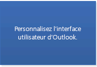
  
] [(selecting-an-api-or-technology-for-developing-solutions-for-outlook.md#OLSelectAPI_CustomizeTheOutlookInterface)
  
](http://msdn.microsoft.com/library/6ea4babf-facf-4018-ef5a-4a484e55153a%28Office.15%29.aspx)[
  
] (selecting-an-api-or-technology-for-developing-solutions-for-outlook.md#OLSelectAPI_ItemPropFieldsForms)
  
[
  
] [(selecting-an-api-or-technology-for-developing-solutions-for-outlook.md#OLSelectAPI_Events)
  
] (selecting-an-api-or-technology-for-developing-solutions-for-outlook.md#OLSelectAPI_AutomateOutlook)
  
En plus des scénarios de référence, si votre solution Outlook prend en charge l'un des scénarios indiqués dans la figure 3, et que vous prévoyez d'exécuter votre solution sur Outlook 2007 ou version ultérieure, mais pas sur des versions antérieures, vous pouvez également utiliser le modèle objet ou l'assembly PIA. La figure 3 indique les principaux objets ou membres que vous pouvez utiliser dans le modèle objet Outlook pour étendre chaque scénario (à l'exception de l'interface [IDTExtensibility2](https://msdn.microsoft.com/library/Extensibility.IDTExtensibility2.aspx) dans le modèle objet Automation de Visual Studio, et l'interface [IRibbonExtensibility](http://msdn.microsoft.com/library/b27a7576-b6f5-031e-e307-78ef5f8507e0%28Office.15%29.aspx) dans le modèle objet Office, que vous pouvez intégrer au modèle objet Outlook). 
  
Figure 3. Scénarios supplémentaires pris en charge par le modèle objet ou l'assembly PIA depuis la version Outlook 2007
  
[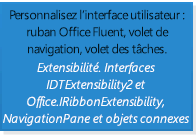
  
] [(selecting-an-api-or-technology-for-developing-solutions-for-outlook.md#OLSelectAPI_CustomizeTheOutlookInterface)
  
] [(selecting-an-api-or-technology-for-developing-solutions-for-outlook.md#OLSelectAPI_CustomFormRegions)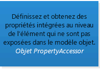
  
] (selecting-an-api-or-technology-for-developing-solutions-for-outlook.md#OLSelectAPI_CustomizingProperties)
  
[
  
] [(selecting-an-api-or-technology-for-developing-solutions-for-outlook.md#OLSelectAPI_Enumerating)
  
] [(selecting-an-api-or-technology-for-developing-solutions-for-outlook.md#OLSelectAPI_ItemsFlag)
  
] (selecting-an-api-or-technology-for-developing-solutions-for-outlook.md#OLSelectAPI_Sharing)
  
[
  
] [(selecting-an-api-or-technology-for-developing-solutions-for-outlook.md#OLSelectAPI_Attachments)
  
] [(selecting-an-api-or-technology-for-developing-solutions-for-outlook.md#OLSelectAPI_Misc)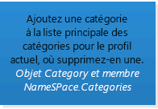
  
] (selecting-an-api-or-technology-for-developing-solutions-for-outlook.md#OLSelectAPI_Categories)
  
[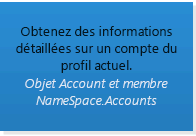
  
] [(selecting-an-api-or-technology-for-developing-solutions-for-outlook.md#OLSelectAPI_PrimaryAccount)
  
] [(selecting-an-api-or-technology-for-developing-solutions-for-outlook.md#OLSelectAPI_AddressBook)
  
] (selecting-an-api-or-technology-for-developing-solutions-for-outlook.md#OLSelectAPI_StoringData)
  
Si vous prévoyez d'exécuter votre solution Outlook sur Outlook 2010, et non sur les versions antérieures, vous pouvez choisir d'utiliser le modèle objet ou l'assembly PIA pour prendre en charge les scénarios indiqués dans la figure 4. Celle-ci indique les objets ou membres principaux que vous pouvez utiliser dans le modèle objet Outlook pour étendre chaque scénario (à l'exception des interfaces [IRibbonControl](http://msdn.microsoft.com/library/63aef709-e1d3-b1a6-76af-b568ad0e69ae%28Office.15%29.aspx), [IRibbonExtensibility](http://msdn.microsoft.com/library/b27a7576-b6f5-031e-e307-78ef5f8507e0%28Office.15%29.aspx) et [IRibbonUI](http://msdn.microsoft.com/library/d323aa21-de74-e821-c914-db71ef3b9c5e%28Office.15%29.aspx) qui se trouvent dans le modèle objet Office, que vous pouvez intégrer au modèle objet Outlook). 
  
Figure 4. Scénarios supplémentaires pris en charge par le modèle objet ou l'assembly PIA depuis la version Outlook 2010
  
[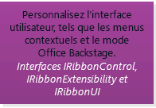
  
] [(selecting-an-api-or-technology-for-developing-solutions-for-outlook.md#OLSelectAPI_CustomizingUIOutlook2010)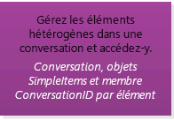
  
] [(selecting-an-api-or-technology-for-developing-solutions-for-outlook.md#OLSelectAPI_Conversations)
  
] (selecting-an-api-or-technology-for-developing-solutions-for-outlook.md#OLSelectAPI_ItemSelection)
  
[
  
] [(selecting-an-api-or-technology-for-developing-solutions-for-outlook.md#OLSelectAPI_AttachmentSelection)
  
] [(selecting-an-api-or-technology-for-developing-solutions-for-outlook.md#OLSelectAPI_MultipleAccounts)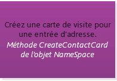
  
](http://msdn.microsoft.com/library/d050e0e3-3c0d-bd01-f008-2628056625d1%28Office.15%29.aspx)
  
[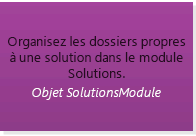
  
] (selecting-an-api-or-technology-for-developing-solutions-for-outlook.md#OLSelectAPI_Folders)
  
Si vous prévoyez d'exécuter votre solution sur Outlook 2013, et non sur les versions antérieures, vous pouvez utiliser le modèle objet ou l'assembly PIA afin qu'il prenne en charge les scénarios indiqués dans la figure 5.
  
Figure 5. Scénarios supplémentaires pris en charge par le modèle objet ou l'assembly PIA depuis la version Outlook 2013
  
[
  
] [(selecting-an-api-or-technology-for-developing-solutions-for-outlook.md#OLSelectAPI_InlineResponse)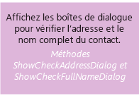
  
] (selecting-an-api-or-technology-for-developing-solutions-for-outlook.md#OLSelectAPI_ContactCheckDialogs)
  

  
## Facteurs de décision pour MAPI

En règle générale, vous utilisez MAPI pour accéder aux données sur un serveur basé sur MAPI, tel que le serveur Microsoft Exchange, ainsi que pour effectuer des tâches comme les suivantes :
  
- Créer un fournisseur de services personnalisé, tel qu'un fournisseur de carnets d'adresses, de transports ou de banques.
    
- Créer un processus de récepteur.
    
- Créer ou manipuler un profil.
    
- Exécuter une application en tant que service Windows NT.
    
- Exécuter des tâches sur un thread d'arrière-plan. Par exemple, l'énumération de nombreux éléments dans un dossier et la modification des propriétés des éléments dans un thread d'arrière-plan peuvent optimiser les performances.
    
Pour plus d'informations et d'exemples de code, voir [Référence MAPI Outlook](http://msdn.microsoft.com/library/3d980b86-7001-4869-9780-121c6bfc7275%28Office.15%29.aspx) et [MFCMAPI](http://mfcmapi.codeplex.com/).
  
En outre, si votre solution est exécutée sur une version antérieure à Outlook 2007, et que des scénarios comme le suivant s'appliquent à votre solution, vous devez utiliser MAPI pour étendre ces scénarios.
  
- Définir et obtenir des propriétés de niveau élément intégrées qui ne sont pas exposées dans le modèle objet.
    
- Gérer des comptes, pièces jointes, listes de distribution Exchange, utilisateurs Exchange ou banques.
    
- Stocker des données privées pour des solutions.
    
- Gérer une banque de messages pour un compte.
    
Depuis Outlook 2007, le modèle objet prend en charge une gamme de fonctionnalités que les développeurs, avant cette version, devaient résoudre via MAPI ou d'autres API, telles que Microsoft Collaboration Data Objects (CDO) 1.2.1 et les extensions du client Microsoft Exchange. Par conséquent, si l'un des scénarios de la liste précédente s'applique à votre solution, mais que votre solution est exécutée sur Outlook 2007 ou Outlook 2010, vous pouvez et devez utiliser le modèle objet ou l'assembly PIA d'Outlook pour prendre en charge ces scénarios. Pour plus d'informations sur les améliorations d'Outlook 2007 qui unifient les technologies de développement Outlook, voir [What's New for Developers in Outlook 2007 (Part 1 of 2)](http://msdn.microsoft.com/library/76e3f0b7-ef2b-4e9f-8515-3002d75d7721%28Office.15%29.aspx).
  
## Facteurs de décision pour les API auxiliaires

Les API auxiliaires Outlook peuvent s'intégrer à la logique métier Outlook ou MAPI dans certains scénarios dans lesquels le modèle objet ou MAPI ne fournit pas de solution. Utilisez les API auxiliaires Outlook dans les scénarios suivants :
  
- Gestion de compte : gérez des informations de compte, manipulez des comptes, envoyez des notifications sur les modifications apportées à un compte et protégez les comptes du courrier indésirable. 
    
- Dégradation de données : incluez dans un wrapper un objet dans un format de caractères préféré plutôt que de l'exposer dans son format natif.
    
- Redéfinition des calendriers et de la prise en charge du fuseau horaire : redéfinissez les calendriers Outlook pour qu'ils prennent en charge l'heure d'été.
    
- Disponibilité : indiquez des informations de disponibilité sur des calendriers.
    
- Images des contacts : déterminez l'affichage de l'image d'un contact dans Outlook.
    
- Devise de l'élément : déterminez si un élément Outlook comporte des modifications non enregistrées.
    
- Catégorisation d'un article : catégorisez un élément Outlook après son envoi.
    
Pour plus d'informations sur les API auxiliaires, voir la section [Ressources supplémentaires : API auxiliaires](#OLSelectAPI_AdditionalResourcesAuxAPIs). 
  
## Automatisation d'Outlook par solutions in-process par rapport à des solutions hors processus

> [!NOTE]
> [!REMARQUE] La discussion portant sur l'automatisation d'Outlook dans cette section et la suivante ne relève pas des Compléments Office, qui sont prévues pour étendre les fonctionnalités de l'application cliente ou web Office, et non pour l'automatiser. 
  
Outlook prend en charge l'automatisation à l'aide de compléments exécutés dans le même processus de premier plan, et par des solutions autonomes exécutées dans leur propre processus distinct en dehors du processus Outlook. En règle générale, pour automatiser Outlook, utilisez un complément pour interagir avec Outlook via le modèle objet, l'assembly PIA ou MAPI, et dans des scénarios moins courants, via une API auxiliaire (telle que [HrProcessConvActionForSentItem](auxiliary/hrprocessconvactionforsentitem.md)). Utilisez une solution hors processus uniquement lorsque cela est nécessaire (par exemple, lors de l'écriture d'une application cliente MAPI qui utilise le fichier Tzmovelib.dll pour redéfinir des calendriers Outlook pour les clients, ou lors de l'énumération de nombreux éléments dans un dossier et de la modification des propriétés des éléments dans un thread d'arrière-plan pour optimiser les performances). 
  
Les compléments sont la solution de choix de l'automatisation d'Outlook car, ce dernier approuve uniquement l'objet [Application](http://msdn.microsoft.com/library/797003e7-ecd1-eccb-eaaf-32d6ddde8348%28Office.15%29.aspx) transmis au complément lors de l'événement [OnConnection(Object, ext_ConnectMode, Object, Array)](https://msdn.microsoft.com/library/Extensibility.IDTExtensibility2.OnConnection.aspx) du complément. Vous pouvez éviter l'affichage des avertissements de sécurité de la protection du modèle objet en dérivant tous les objets, ainsi que toutes les propriétés et méthodes de cet objet **Application**. Si le complément crée une instance de l'objet **Application**, Outlook ne l'approuve pas, même si le complément figure dans la liste des compléments approuvés. Tout objet, ainsi que toute propriété et méthode dérivés d'un tel objet **Application** ne seront pas approuvés et les propriétés et méthodes bloquées appelleront des avertissements de sécurité. Pour plus d'informations sur la protection du modèle objet, voir [Comportement de sécurité du modèle objet Outlook (en anglais)](http://msdn.microsoft.com/library/4aa3b7c7-5f3f-41ce-bbf3-75d8ecbd6d4f%28Office.15%29.aspx).
  
## Automatisation d'Outlook par des solutions gérées par rapport à des solutions non gérées

Outlook prend en charge l'automatisation par des compléments et des applications autonomes, écrites dans des langages managés ou non managés. C# et Visual Basic sont les langages managés les plus couramment utilisés. Les outils C++ et Delphi sont plus courants dans le développement non managé. L'expertise disponible est un élément à prendre en compte lors du choix entre développement managé et non managé. 
  
Si votre solution utilise uniquement le modèle objet, vous pouvez envisager de développer une solution gérée à l'aide de l'assembly PIA ou des outils de développement Office dans Visual Studio. Ces derniers fournissent des modèles de projet et des concepteurs visuels qui simplifient la création d'interfaces utilisateur personnalisées et le développement de solutions Office.
  
En revanche, Microsoft ne prend pas en charge MAPI dans du code managé car MAPI a été développé avant .NET Framework et que Microsoft ne fournit pas de wrappers managés pour MAPI. Si vous utilisez MAPI, vous devez développer une solution non gérée. Pour plus d'informations, voir [Règles de prise en charge pour le développement de messagerie côté client ](http://support.microsoft.com/kb/266353/en-us).
  
## API et technologies ciblées

Outlook Social Connector (OSC) et la barre météorologique prennent en charge l'extension de scénarios très spécifiques dans Outlook. 
  
### Extensibilité du fournisseur Outlook Social Connector (OSC)

L'extensibilité du fournisseur Outlook Social Connector (OSC) prend en charge le développement d'un fournisseur pour un réseau social qui permet aux utilisateurs d'afficher, dans Outlook ou autres applications clients Office, des mises à jour concernant les amis et activités sur ce réseau social. La figure 6 présente l'OSC qui affiche dans le volet Contacts les activités d'une personne sur des sites de réseaux sociaux.
  
**Figure 6. OSC affichant des données de réseau social dans le volet Contacts**

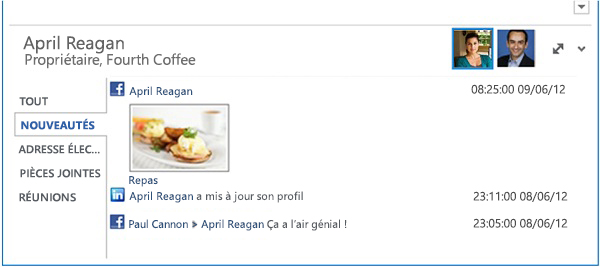
  
OSC dans Outlook permet aux utilisateurs d'afficher, dans le volet Contacts, un regroupement de courriers électroniques, pièces jointes et demandes de réunion d'une personne dans Outlook. Dans un environnement organisationnel, les utilisateurs qui collaborent sur un site SharePoint peuvent voir des mises à jour de documents et d'autres activités de site de cette personne sur le site SharePoint. L'extensibilité du fournisseur Outlook Social Connector prend en charge le développement d'un fournisseur pour OSC afin de synchroniser et d'exposer des mises à jour de réseau social dans Outlook. Les fournisseurs d'OSC courants (tels que Facebook et LinkedIn) sont installés par défaut avec Outlook. En fonction des sites de réseau social auquel un utilisateur Outlook est connecté, l'utilisateur peut voir, dans le volet Contacts, des mises à jour, telles que des photos, statuts et activités sur les réseaux sociaux correspondants. 
  
### Extensibilité de la barre météorologique

À partir de la version Outlook 2013, la barre météorologique permet aux développeurs de connecter un service web de météorologie tiers dans la barre météorologique, afin d'indiquer des données de conditions météorologiques pour un emplacement choisi par l'utilisateur. La barre météorologique dans Outlook affiche les conditions et prévisions météorologiques pour un emplacement géographique. Un utilisateur peut choisir un ou plusieurs emplacements, et visualiser facilement les données météorologiques dans la barre météorologique dans le module de calendrier. La figure 7 présente la barre météorologique affichant une prévision sur trois jours pour New York, NY. 
  
**Figure 7. Barre météorologique dans Outlook**

  
Par défaut, Outlook utilise les données météorologiques fournies par MSN Météo. La barre météorologique prend en charge des services web de données météorologiques tiers qui suivent un protocole défini pour communiquer avec Outlook. Tant que le service de données météorologiques tiers prend en charge ce protocole, les utilisateurs peuvent le choisir afin d'obtenir des données météorologiques dans la barre météorologique.
  
Voir la section [Ressources supplémentaires : références principales, ressources et exemples de code](#OLSelectAPI_AdditionalResourcesRefCode) pour plus d'informations sur l'utilisation de l'extensibilité du fournisseur OSC et l'extensibilité de la barre météorologique. 
  
## Conclusion

Pour déterminer l'API ou la technologie la mieux adaptée à votre solution, vous devez d'abord définir les objectifs de votre solution : 
  
- Les versions d'Outlook que votre solution va prendre en charge.
    
- Les scénarios de priorité élevée de votre solution. Est-ce que votre solution interagit principalement avec le contenu et les propriétés d'élément de message ou de rendez-vous ? Ou est-ce que votre solution automatise Outlook au niveau de l'application ? Si tel est le cas, est-ce que ces scénarios impliquent l'énumération, le filtrage ou la modification de dossiers contenant de nombreux éléments Outlook ?
    
Tout d'abord, vérifiez si la prise en charge de l'application de messagerie dans la plateforme des Compléments Office répond à vos besoins. Voir la section Critères fonctionnels de [Critères d'évaluation objectifs pour la plateforme des applications pour Office](#OLSelectAPI_ObjectiveEvalCritApps) afin de déterminer si les objets et fonctionnalités principaux prennent en charge vos scénarios. Voir la section [Facteurs de décision pour la plateforme des applications pour Office](#OLSelectAPI_FactorsApps) afin de vérifier si les applications de messagerie constituent un meilleur choix que les compléments pour vos scénarios. En général, développez votre solution en tant qu'application, si possible, pour bénéficier de la prise en charge de la plateforme dans les clients Outlook sur différents facteurs de forme. 
  
Si vos scénarios exigent que vous étendiez au-delà des éléments de message ou de rendez-vous, ou que vous automatisiez Outlook au niveau de l'application, essayez de faire correspondre vos scénarios avec ceux présentés dans la section [Facteurs de décision pour le modèle objet ou l'assembly PIA](#OLSelectAPI_FactorsOM). Si le modèle objet (ou l'assembly PIA) de vos versions Outlook cible prend en charge vos scénarios, et que votre solution ne manipule pas de dossiers contenant un grand nombre d'éléments, vous devez implémenter votre solution en tant que complément, dans un langage managé ou non managé. 
  
Si le modèle objet (ou l'assembly PIA) de la version Outlook cible ne prend pas en charge certains de vos scénarios, vérifiez si les scénarios dans la section [Facteurs de décision pour MAPI](#OLSelectAPI_FactorsMAPI) ou [Facteurs de décision pour les API auxiliaires](#OLSelectAPI_FactorsAux) répondent à vos besoins. Si MAPI répond à vos besoins, vous devez implémenter votre solution en code non managé. Si une API auxiliaire résout l'un de vos scénarios, vous pouvez utiliser du code managé ou non managé. 
  
Si votre solution utilise l'interface MAPI, vous devez l'implémenter dans du code non managé, tel que C++. Sinon, la décision d'utiliser du code managé ou non managé pour créer la solution dépend en général de vos ressources disponibles et de leur expertise. Quant à la décision d'implémenter la solution en tant que complément ou application autonome, choisissez un complément afin d'éviter que l'utilisateur n'appelle constamment la protection du modèle objet Outlook, à moins que la manipulation de dossiers contenant de nombreux éléments soit nécessaire dans votre scénario. Dans le dernier scénario, l'implémentation de la solution en vue d'une exécution en tant que thread d'arrière-plan peut optimiser les performances d'Outlook.
  
Si vos scénarios ne comprennent pas l'affichage d'informations ou de mises à jour de réseau social dans Outlook, vous devez utiliser l'extensibilité du fournisseur OSC afin de créer une DLL visible par COM. Vous pouvez faire cela dans un langage managé ou non managé.
  
Si vous souhaitez connecter un service de données météorologiques tiers à la barre météorologique, vous pouvez suivre le protocole défini par l'extensibilité de la barre météorologique et indiquer les services web appropriés. Vous pouvez créer ces services web dans un langage managé.
  
Après avoir choisi les API ou technologies à utiliser dans votre solution, vous pouvez consulter la documentation et les exemples de code supplémentaires dans la section [Ressources supplémentaires : références principales, ressources et exemples de code](#OLSelectAPI_AdditionalResourcesRefCode) pour plus d'informations. 
  
## Voir aussi : compléments Office

[Vue d'ensemble de la plateforme des compléments pour Office](http://msdn.microsoft.com/library/e64de870-ce22-4331-92e7-76d35279bf91%28Office.15%29.aspx) fournit une bonne introduction sur les Compléments Office, notamment l'architecture et le cycle de vie de développement. 
  
Voir [Compléments Outlook](http://msdn.microsoft.com/library/71e64bc9-e347-4f5d-8948-0a47b5dd93e6%28Office.15%29.aspx) pour un plan détaillé des ressources sur le développement d'applications de messagerie. 
  
## Voir aussi : modèle objet et assembly PIA

Les ressources suivantes fournissent plus d'informations sur l'utilisation du modèle objet et de l'assembly PIA.
  
### Comptes : compte Exchange principal dans le profil

- Objet [Account](http://msdn.microsoft.com/library/f624438c-4e45-2822-18b6-bfe8074a33c0%28Office.15%29.aspx) 
    
- Propriété [NameSpace.Accounts](http://msdn.microsoft.com/library/80e969ea-d2cc-966d-5fe4-68d59951b5c9%28Office.15%29.aspx) 
    
### Comptes : plusieurs comptes dans le profil

- Objet [Account](http://msdn.microsoft.com/library/f624438c-4e45-2822-18b6-bfe8074a33c0%28Office.15%29.aspx) 
    
- [Utilisation de plusieurs comptes pour le même profil dans Outlook](http://msdn.microsoft.com/library/9e06e076-d62a-37c8-4502-709da5a0b104%28Office.15%29.aspx)
    
- [Obtenir des informations pour plusieurs comptes](http://msdn.microsoft.com/library/af587ee2-429a-252f-ecb6-2f058b9a37a8%28Office.15%29.aspx)
    
- [Manipulation de plusieurs comptes Exchange dans Outlook 2010 (traduction automatique)](http://msdn.microsoft.com/library/b5a80da9-102d-4617-8a06-49ded01a237a%28Office.15%29.aspx)
    
### Carnet d'adresses et utilisateurs Exchange

- [Afficher les noms du Carnet d'adresses](http://msdn.microsoft.com/library/32e7179c-8133-ee20-ecf6-52c9275f205f%28Office.15%29.aspx)
    
- [Accéder aux informations sur les utilisateurs d'Exchange et les listes de distribution à partir du Carnet d'adresses](http://msdn.microsoft.com/library/077a8666-09c5-e641-0b9b-7d83133d931f%28Office.15%29.aspx)
    
- [Répertorier les groupes auxquels mon responsable appartient](http://msdn.microsoft.com/library/2f0ff92c-e026-4f62-c039-fbda9aaf1546%28Office.15%29.aspx)
    
- [Répertorier le nom et l’emplacement du bureau de chaque responsable appartenant à une liste de distribution Exchange](http://msdn.microsoft.com/library/abc26854-62db-be7f-4025-46acbcb42541%28Office.15%29.aspx)
    
- Objet [AddressEntries](http://msdn.microsoft.com/library/db91b717-07c6-d1f2-c545-b766ee1f0c6b%28Office.15%29.aspx) 
    
- Objet [AddressLists](http://msdn.microsoft.com/library/b8c5ce75-3030-0179-45bb-f44fe6628074%28Office.15%29.aspx) 
    
- Objet [ExchangeDistributionList](http://msdn.microsoft.com/library/2830dfba-6c0a-a81f-6b98-92ac2aafb59d%28Office.15%29.aspx) 
    
- Objet [ExchangeUser](http://msdn.microsoft.com/library/6ec117d1-7fdb-aa36-b567-1242f8238df0%28Office.15%29.aspx) 
    
- Objet [SelectNamesDialog](http://msdn.microsoft.com/library/1522736a-3cad-9f1c-4da9-b52a3a01731c%28Office.15%29.aspx) 
    
### Pièces jointes

- [Joindre un fichier à un élément de messagerie](http://msdn.microsoft.com/library/1d94629b-e713-92cb-32de-c8910612e861%28Office.15%29.aspx)
    
- [Types de fichiers de pièces jointes restreints par Outlook 2010](http://technet.microsoft.com/en-us/library/cc179163.aspx)
    
- Objet [Attachment](http://msdn.microsoft.com/library/3e11582b-ac90-0948-bc37-506570bb287b%28Office.15%29.aspx) 
    
- Objet [AttachmentSelection](http://msdn.microsoft.com/library/398cf106-a904-9048-e627-e47aaadf1105%28Office.15%29.aspx) 
    
- Événement **AttachmentAdd** par objet d'élément 
    
- Événement **AttachmentRead** par objet d'élément 
    
- Événement **AttachmentRemove** par objet d'élément 
    
- Événement **BeforeAttachmentAdd** par objet d'élément 
    
- Événement **BeforeAttachmentPreview** par objet d'élément 
    
- Événement **BeforeAttachmentRead** par objet d'élément 
    
- Événement **BeforeAttachmentSave** par objet d'élément 
    
- Événement **BeforeAttachmentWrite** par objet d'élément 
    
### Pièces jointes : sélection dans l'inspecteur

- Propriété [Inspector.AttachmentSelection](http://msdn.microsoft.com/library/19466ce7-def8-4cce-1776-dcea1df9f15d%28Office.15%29.aspx) 
    
- Événement [Inspector.AttachmentSelectionChange](http://msdn.microsoft.com/library/1250045d-bcb3-b823-31d5-ec31c64ad59e%28Office.15%29.aspx) 
    
### Automatisation d'Outlook

- [Personnalisation de Microsoft Outlook à l'aide de compléments COM](http://msdn.microsoft.com/library/84a4f616-3ace-0139-57d5-f0c070064ab2%28Office.15%29.aspx)
    
- [Génération d'un complément C++ pour Outlook 2010](http://msdn.microsoft.com/library/70b308e7-d713-4a26-9892-5021f7320674%28Office.15%29.aspx)
    
- [Introduction à l'interopérabilité entre COM et .NET](http://msdn.microsoft.com/library/6b2d099a-ec6f-4099-aaf6-e61003fe5a32%28Office.15%29.aspx)
    
- [Pourquoi utiliser l'assembly PIA Outlook PIA ?](http://msdn.microsoft.com/library/5cc9085e-7c97-4698-8cb9-e33e427c02e7%28Office.15%29.aspx)
    
- [Les meilleures pratiques de développement géré des compléments Outlook](http://msdn.microsoft.com/library/a03246f6-2ca5-4fcb-8e63-a11cfbc8d9a0%28Office.15%29.aspx)
    
- [Obtenir et se connecter à une Instance d’Outlook](http://msdn.microsoft.com/library/ef369364-6500-2759-3ef4-ed4411112e96%28Office.15%29.aspx)
    
- [Automatisation d'Outlook à partir d'une application Visual Basic](http://msdn.microsoft.com/library/623f91af-cd50-1ff0-9519-5a39cbcf5d18%28Office.15%29.aspx)
    
- [Automatisation d'Outlook à partir d'autres applications Office](http://msdn.microsoft.com/library/d3e44f80-df67-2d28-94dc-14d7a8c8c26c%28Office.15%29.aspx)
    
### Catégories

- [Classer vos éléments Outlook](http://msdn.microsoft.com/library/e8cfb450-b8b0-bee6-fdf0-d0a92bf9af56%28Office.15%29.aspx)
    
- Objet [Category](http://msdn.microsoft.com/library/143ef095-54b0-cbe2-e356-632029061ac2%28Office.15%29.aspx) 
    
- Propriété [NameSpace.Categories](http://msdn.microsoft.com/library/3963afca-3a7e-38d7-1347-7e1467be3a10%28Office.15%29.aspx) 
    
### Contacts : vérifiez l'adresse et le nom complet

- Méthode [ContactItem.ShowCheckAddressDialog](http://msdn.microsoft.com/library/773a1a3c-1247-fd48-399a-728766e56570%28Office.15%29.aspx) 
    
- Méthode [ContactItem.ShowCheckFullNameDialog](http://msdn.microsoft.com/library/d42632e3-6f50-cce7-80c6-cf846be1f925%28Office.15%29.aspx) 
    
### Conversations

- [Gestion des éléments Outlook en tant que conversations](http://msdn.microsoft.com/library/d91959d7-07b2-7952-8e6d-a39422d355e0%28Office.15%29.aspx)
    
- [Obtenir et énumérer les conversations sélectionnées](http://msdn.microsoft.com/library/3bba1e98-b2eb-c53d-354a-bdd899b65a59%28Office.15%29.aspx)
    
- Objet [Conversation](http://msdn.microsoft.com/library/2705d38a-ebc0-e5a7-208b-ffe1f5446b1b%28Office.15%29.aspx) 
    
- Objet [ConversationHeader](http://msdn.microsoft.com/library/5142d5f7-55c1-4d9d-3a11-d25c8763fcb7%28Office.15%29.aspx) 
    
- Objet [SimpleItems](http://msdn.microsoft.com/library/b929ae28-fe5f-607e-37b5-ed6a304d4896%28Office.15%29.aspx) 
    
- Propriété **ConversationID** par objet d'élément 
    
### Événements

- [Utilisation des événements Outlook](http://msdn.microsoft.com/library/514f8f31-8047-2a9f-cbac-d0a23218f49c%28Office.15%29.aspx)
    
- [Implémentation d’un Wrapper pour les inspecteurs et suivre les événements au niveau élément dans chaque inspecteur](http://msdn.microsoft.com/library/8021dd2b-c36c-492b-b281-783e85140ad8%28Office.15%29.aspx)
    
### Explorateur : réponse incluse

- Propriété [Explorer.ActiveInlineResponse](http://msdn.microsoft.com/library/fc38314d-7cff-44f4-9151-6129f918a721%28Office.15%29.aspx) 
    
- Propriété [Explorer.ActiveInlineResponseWordEditor](http://msdn.microsoft.com/library/b9058694-ab8f-4962-ab7d-afac1704dd29%28Office.15%29.aspx) 
    
- Propriété [Explorer.InlineResponse](http://msdn.microsoft.com/library/5dbaddbd-e6cd-4776-b417-c67f51b12812%28Office.15%29.aspx) 
    
### Éléments : propriétés, champs et formulaires de base

- [Éléments Outlook](http://msdn.microsoft.com/library/6ea4babf-facf-4018-ef5a-4a484e55153a%28Office.15%29.aspx)
    
- Objet [ItemProperties](http://msdn.microsoft.com/library/34a110ed-6617-72da-1e98-a9773c705b40%28Office.15%29.aspx) 
    
- Objet [UserProperties](http://msdn.microsoft.com/library/20b49c86-d74f-9bda-382c-559af278c148%28Office.15%29.aspx) 
    
- [Vue d'ensemble des champs standard](http://msdn.microsoft.com/library/f0d903a3-f404-8511-af3d-d4f3e30f0779%28Office.15%29.aspx)
    
- [Champs Outlook et propriétés équivalentes](http://msdn.microsoft.com/library/acc5d2c5-f579-0a60-5676-3faa63f26c0e%28Office.15%29.aspx)
    
- [Vue d'ensemble des Types de données et de champs personnalisés](http://msdn.microsoft.com/library/a85a7bc2-2b85-1782-04a3-0104e0df32aa%28Office.15%29.aspx)
    
- [Personnalisation de pages et de zones de formulaire](http://msdn.microsoft.com/library/c8c2d080-66a8-b761-bdc0-527b209e0bd1%28Office.15%29.aspx)
    
### Éléments : personnalisation des propriétés

- [Présentation des propriétés](http://msdn.microsoft.com/library/242c9e89-a0c5-ff89-0d2a-410bd42a3461%28Office.15%29.aspx)
    
- [Efficacement obtention et définition des propriétés personnalisées dans un dossier de contacts dans Outlook 2010 (traduction automatique)](http://msdn.microsoft.com/library/bb49f7a6-ec0a-483a-a27e-e843c6af781b%28Office.15%29.aspx)
    
- Objet [PropertyAccessor](http://msdn.microsoft.com/library/2fc91e13-703c-3ec9-9066-ffee7144306c%28Office.15%29.aspx) 
    
### Éléments : énumération, filtrage et tri

- [Stockage des éléments Outlook](http://msdn.microsoft.com/library/e4a639a4-10b2-7665-9261-19d6e7707e48%28Office.15%29.aspx)
    
- [Propriétés par défaut affichées dans un objet Table](http://msdn.microsoft.com/library/649c64f3-2d1e-23f1-bf13-3368da79e62b%28Office.15%29.aspx)
    
- [Filtrage efficace des éléments de Contact dans un dossier de contacts dans Outlook 2010 (traduction automatique)](http://msdn.microsoft.com/library/b8dd39e7-d716-4acd-873b-d2b0faaff30d%28Office.15%29.aspx)
    
- [Énumération, recherche et filtrage d'éléments dans un dossier](http://msdn.microsoft.com/library/d786d292-7a0e-0e1a-e132-affbfde37744%28Office.15%29.aspx)
    
- [Tri des éléments d'un dossier](http://msdn.microsoft.com/library/bc3651da-cfdb-4301-4034-bb848f371e55%28Office.15%29.aspx)
    
- Objet [Table](http://msdn.microsoft.com/library/0affaafd-93fe-227a-acee-e09a86cadc20%28Office.15%29.aspx) 
    
### Éléments : indiquer en tant que tâches

Consultez les propriétés suivantes liées aux tâches dans certains objets d'élément, tel que l'objet [MailItem](http://msdn.microsoft.com/library/14197346-05d2-0250-fa4c-4a6b07daf25f%28Office.15%29.aspx) : 
  
- Propriété [TaskCompleteDate](http://msdn.microsoft.com/library/4bee35d4-1f1e-0b77-2021-84d4916bef8e%28Office.15%29.aspx) 
    
- Propriété [TaskDueDate](http://msdn.microsoft.com/library/161ed0ed-0e3f-2e4c-7e63-daad4e918dd6%28Office.15%29.aspx) 
    
- Propriété [TaskStartDate](http://msdn.microsoft.com/library/76b7109f-55fc-b7e2-63dc-bf7804a709f5%28Office.15%29.aspx) 
    
- Propriété [TaskSubject](http://msdn.microsoft.com/library/f7e4629f-ad47-b455-9fee-b5e537602a34%28Office.15%29.aspx) 
    
- Propriété [ToDoTaskOrdinal](http://msdn.microsoft.com/library/d1ccb01a-0792-3779-3f94-eb5195a39bb0%28Office.15%29.aspx) 
    
### Éléments : sélection dans l'explorateur

- Méthode [Selection.GetSelection](http://msdn.microsoft.com/library/c6af6665-d97d-3833-1014-5b43282bafc2%28Office.15%29.aspx) 
    
- Propriété [Selection.Location](http://msdn.microsoft.com/library/8a2db72a-8db0-840e-349e-5d9d22f3affb%28Office.15%29.aspx) 
    
### Divers : cartes de visite, règles et vues d'entreprise

- [Personnaliser et partager des cartes de visite](http://msdn.microsoft.com/library/d29fd962-ea5f-040d-e9af-e8ab70595832%28Office.15%29.aspx)
    
- [Gestion des règles dans le modèle objet d'Outlook](http://msdn.microsoft.com/library/05ddd643-e9bd-a37d-b680-b8519960a5f6%28Office.15%29.aspx)
    
- [Créer une règle pour déplacer des messages électroniques spécifiques vers un dossier](http://msdn.microsoft.com/library/e72fa307-8224-c2d2-1318-a18cd8e9f22f%28Office.15%29.aspx)
    
- Objet [Rules](http://msdn.microsoft.com/library/dd41b4de-bf5f-5532-46c9-394a5d078bec%28Office.15%29.aspx) 
    
- Objet [RuleActions](http://msdn.microsoft.com/library/82ba76cd-86a4-3372-cb51-2df1d58c8b71%28Office.15%29.aspx) 
    
- Objet [RuleConditions](http://msdn.microsoft.com/library/b2af6ebf-f9f8-8106-20a3-1725c3b78174%28Office.15%29.aspx) 
    
- Objet [TimeZones](http://msdn.microsoft.com/library/c68f8589-44e9-3c12-45c1-96943fa9bcb7%28Office.15%29.aspx) 
    
- [Affichages d'Outlook](http://msdn.microsoft.com/library/cbaa3192-6c27-26c0-ebd6-f6489c2e812e%28Office.15%29.aspx)
    
- Objet [Views](http://msdn.microsoft.com/library/5dd7edc2-12a2-f4c2-d158-8053d80e8dc9%28Office.15%29.aspx) 
    
### Sécurité

- [Comportement de sécurité du modèle objet Outlook (en anglais)](http://msdn.microsoft.com/library/4aa3b7c7-5f3f-41ce-bbf3-75d8ecbd6d4f%28Office.15%29.aspx)
    
- [Modifications de l'arrêt d'Outlook 2010](http://msdn.microsoft.com/library/1b154d46-8d13-4c65-91e3-180b22603d03%28Office.15%29.aspx)
    
- [Types de fichiers de pièces jointes restreints par Outlook 2010](http://technet.microsoft.com/en-us/library/cc179163.aspx)
    
- [Application Shutdown Changes in Outlook 2007 SP2](http://msdn.microsoft.com/library/795a8237-7804-4da4-9d04-2bb663d300d9%28Office.15%29.aspx)
    
- [Code Security Changes in Outlook 2007](http://msdn.microsoft.com/library/26a9fd8f-6277-48ac-a92f-3ff46e1d883a%28Office.15%29.aspx)
    
### Partage

- [Partage de calendriers](http://msdn.microsoft.com/library/03e0b693-5446-ca62-f868-69a583087966%28Office.15%29.aspx)
    
- [Partage de calendriers en ligne, de flux RSS, de dossiers Microsoft SharePoint Foundation et de dossiers Exchange](http://msdn.microsoft.com/library/e579e026-bd10-37bb-eb3e-5c9f042fa0fa%28Office.15%29.aspx)
    
- Objet [SharingItem](http://msdn.microsoft.com/library/63dd3451-44f3-7cc4-c6e2-7dad5835a7d2%28Office.15%29.aspx) 
    
### Solutions : dossiers propres à la solution

- [ Programmation du module Solutions d'Outlook 2010 ](http://msdn.microsoft.com/library/5989a3da-2f2a-4abd-87b0-cc0e1560dd59%28Office.15%29.aspx)
    
- Objet [SolutionsModule](http://msdn.microsoft.com/library/4597765e-a95d-bf07-2ac4-103218ebc696%28Office.15%29.aspx) 
    
### Solutions : stockage de données

- [Stockage des données de solutions](http://msdn.microsoft.com/library/58e69983-5718-4dde-64fc-858abd80c9e5%28Office.15%29.aspx)
    
- Objet [StorageItem](http://msdn.microsoft.com/library/41776bc3-b838-2755-fd6b-3b5012fb9ae5%28Office.15%29.aspx) 
    
### Interface utilisateur : personnalisation des zones de formulaire

- [Personnalisation de pages et de zones de formulaire](http://msdn.microsoft.com/library/c8c2d080-66a8-b761-bdc0-527b209e0bd1%28Office.15%29.aspx)
    
- [Zones de formulaire](http://msdn.microsoft.com/library/66e80f83-60db-e3b1-47e9-097f855f6512%28Office.15%29.aspx)
    
- [Créer une zone de formulaire](http://msdn.microsoft.com/library/695b95a5-c795-cb4a-8d35-ba12b0007b1f%28Office.15%29.aspx)
    
- [Présentation : Ajouter une zone de formulaire à une page existante d'un formulaire](http://msdn.microsoft.com/library/3c988dac-f171-966d-cf9a-17139353d604%28Office.15%29.aspx)
    
- [Building an Outlook 2007 Form Region with a Managed Add-In](http://msdn.microsoft.com/library/cc8503c2-9e17-4718-a757-9f0b7d42f0ee%28Office.15%29.aspx)
    
- [Implémentation d'une zone de formulaire pour afficher les en-têtes de messagerie dans Outlook 2010 (traduction automatique)](http://msdn.microsoft.com/library/243a4e64-d4ea-4cfc-871e-af19d622fb1b%28Office.15%29.aspx)
    
- Objet [FormRegion](http://msdn.microsoft.com/library/3a0b83eb-4076-9cb3-86a9-68f9e44df89f%28Office.15%29.aspx) 
    
- Objet [FormRegionStartup](http://msdn.microsoft.com/library/948ea6b7-2962-57e7-618d-fa0977b65651%28Office.15%29.aspx) 
    
### Interface utilisateur : personnalisation depuis Outlook 2007

- [Présentation de la personnalisation du Ruban](http://msdn.microsoft.com/library/ee49751d-9eae-357c-5fa9-0b2dd4ff0890%28Office.15%29.aspx)
    
- [Customizing the Ribbon in Outlook 2007](http://msdn.microsoft.com/library/946e97ea-f556-4e84-8fac-01cd9214e170%28Office.15%29.aspx)
    
- [Developing Interfaces in Outlook 2007](http://msdn.microsoft.com/library/e50257a3-98dd-498f-b9ff-dbfb6705a95a%28Office.15%29.aspx)
    
- [Custom Task Panes Overview](http://msdn.microsoft.com/library/9a415109-5333-433e-95c6-3d59ce9c4d02.aspx)
    
- [Ciblage de solutions d'interface utilisateur pour les versions 2007 et 2010 de Microsoft Office](http://msdn.microsoft.com/library/98726fb2-5d5c-44be-80c3-cfef926471f9%28Office.15%29.aspx)
    
- [Personnalisation du volet de navigation](http://msdn.microsoft.com/library/426c3d1c-13b5-cac5-702d-87dfe71f2478%28Office.15%29.aspx)
    
- [Référence du modèle d'objet Affichage Outlook](http://msdn.microsoft.com/library/36fa9303-2135-6fcc-b93c-05eef37af3ec%28Office.15%29.aspx)
    
- Interface [IDTExtensibility2](https://msdn.microsoft.com/library/Extensibility.IDTExtensibility2.aspx) 
    
- Objet [IRibbonExtensibility](http://msdn.microsoft.com/library/b27a7576-b6f5-031e-e307-78ef5f8507e0%28Office.15%29.aspx) 
    
- Objet [NavigationPane](http://msdn.microsoft.com/library/b6538c72-6115-99fc-c926-e0532a747823%28Office.15%29.aspx) 
    
### Interface utilisateur : personnalisation depuis Outlook 2010

- [Extension de l'interface utilisateur dans Outlook 2010](http://msdn.microsoft.com/library/00b504b0-e897-43b9-8615-44276166823f%28Office.15%29.aspx)
    
- [Extensibilité de l'interface utilisateur Office Fluent pour Outlook](http://msdn.microsoft.com/library/8496c52e-1f9d-16ef-2fd8-c1bca1a96816%28Office.15%29.aspx)
    
- [ Programmation du module Solutions d'Outlook 2010 ](http://msdn.microsoft.com/library/5989a3da-2f2a-4abd-87b0-cc0e1560dd59%28Office.15%29.aspx)
    
- [Personnalisation du Menu contextuel d'une fiche Contact Outlook 2010 (traduction automatique)](http://msdn.microsoft.com/library/8513c8de-15d7-4396-8ced-f5f56f4cd9b3%28Office.15%29.aspx)
    
- Objet [IRibbonControl](http://msdn.microsoft.com/library/63aef709-e1d3-b1a6-76af-b568ad0e69ae%28Office.15%29.aspx) 
    
- Objet [IRibbonExtensibility](http://msdn.microsoft.com/library/b27a7576-b6f5-031e-e307-78ef5f8507e0%28Office.15%29.aspx) 
    
- Objet [IRibbonUI](http://msdn.microsoft.com/library/d323aa21-de74-e821-c914-db71ef3b9c5e%28Office.15%29.aspx) 
    
### Interface utilisateur : dossiers propres aux solutions

- [ Programmation du module Solutions d'Outlook 2010 ](http://msdn.microsoft.com/library/5989a3da-2f2a-4abd-87b0-cc0e1560dd59%28Office.15%29.aspx)
    
- [Ajouter des dossiers spécifiques à la Solution au Module de Solutions Outlook 2010 (traduction automatique)](http://msdn.microsoft.com/library/9709af57-1577-4497-8c9c-3d239353e2ed%28Office.15%29.aspx)
    
- Objet [SolutionsModule](http://msdn.microsoft.com/library/4597765e-a95d-bf07-2ac4-103218ebc696%28Office.15%29.aspx) 
    
## Voir aussi : API auxiliaires

Les ressources suivantes fournissent plus d'informations sur les API auxiliaires d'Outlook.
  
### Gestion des comptes

- [À propos de l'API de gestion de compte](auxiliary/about-the-account-management-api.md)
    
- [Référence des API de gestion des comptes](auxiliary/account-management-api-reference.md)
    
- [À propos des paramètres anti-spam](auxiliary/about-anti-spam-settings.md)
    
### Catégorisation des éléments

- [HrProcessConvActionForSentItem](auxiliary/hrprocessconvactionforsentitem.md)
    
### Images des contacts

- [Spécifier s’il faut afficher l’image d’un contact dans Outlook (autre référence Outlook)](https://msdn.microsoft.com/en-us/library/office/gg262879.aspx)
    
### Dégradation de données

- [À propos de la couche de dégradation de données API](auxiliary/about-the-data-degradation-layer-api.md)
    
- [Références de couche API de dégradation de données](auxiliary/data-degradation-layer-api-reference.md)
    
### Disponibilité

- [À propos de l'API de type disponible/occupé](auxiliary/about-the-free-busy-api.md)
    
- [Utiliser l’heure relative pour accéder aux données et de disponibilité](auxiliary/how-to-use-relative-time-to-access-free-busy-data.md)
    
- [Référence des API de type disponible/occupé](auxiliary/free-busy-api-reference.md)
    
### Devise de l'élément

- [Déterminer si un élément Outlook a été modifié mais ne pas enregistré (autre référence Outlook)](auxiliary/how-to-determine-if-outlook-item-has-been-modified-but-not-saved.md)
    
### Redéfinition de calendriers

- [À propos de la relocalisation des calendriers par programme à l'heure](auxiliary/about-rebasing-calendars-programmatically-for-daylight-saving-time.md)
    
- [À propos de persistance TZDEFINITION dans un flux de valider une propriété binaire](auxiliary/about-persisting-tzdefinition-to-a-stream-to-commit-to-a-binary-property.md)
    
- [Analyser un flux de données à partir d’une propriété binaire à lire la structure TZDEFINITION](auxiliary/how-to-parse-stream-from-binary-property-to-read-tzdefinition-structure.md)
    
- [Analyser un flux de données à partir d’une propriété binaire à lire la structure TZREG](auxiliary/how-to-parse-a-stream-from-a-binary-property-to-read-the-tzreg-structure.md)
    
- [Lire les propriétés de fuseau horaire à partir d’un rendez-vous](auxiliary/how-to-read-time-zone-properties-from-an-appointment.md)
    
## Voir aussi : références principales, ressources et exemples de code

Les ressources suivantes fournissent plus d'informations sur les références principales, les ressources et les exemples de code d'Outlook.
  
### Références et ressources principales

- [Compléments Office](http://msdn.microsoft.com/library/1e123201-6e70-45c1-a48c-d5b955896ddb%28Office.15%29.aspx)
    
- [Référence pour développeur Outlook 2013](http://msdn.microsoft.com/library/75e4ad96-62a2-49d2-bc51-48ceab50634c%28Office.15%29.aspx)
    
- [Référence pour l'assembly PIA (Primary Interop Assembly) d'Outlook 2010](http://msdn.microsoft.com/library/54bdde85-8dc9-4498-a1ac-f72eaf8f0cd3%28Office.15%29.aspx)
    
- [Référence MAPI Outlook](http://msdn.microsoft.com/library/3d980b86-7001-4869-9780-121c6bfc7275%28Office.15%29.aspx)
    
- [Référence auxiliaire d'Outlook 2013](auxiliary/welcome-to-the-outlook-auxiliary-reference.md)
    
- [Référence du fournisseur Outlook Social Connector](social-connector/outlook-social-connector-provider-reference.md)
    
- [Extension de la barre météorologique dans Outlook](weather/extending-the-weather-bar-in-outlook.md)
    
- [Outlook Weather Information XML Schema](weather/outlook-weather-information-xml-schema.md)
    
- [Outlook Weather Location XML Schema](weather/outlook-weather-location-xml-schema.md)
    
- [Nouveautés dans les schémas XML pour Outlook 2010](http://msdn.microsoft.com/library/52f91e6f-a774-488c-8e55-111ae8f68f8a%28Office.15%29.aspx)
    
- [Outlook 2010 : référence pour le schéma XML](http://www.microsoft.com/downloads/en/details.aspx?FamilyID=10ca414a-6cff-46a1-a521-e42c25f079d3&amp;displaylang=en)
    
- [Développement de solutions Outlook 2010 pour des systèmes 32 bits et 64 bits](http://msdn.microsoft.com/library/076753e1-6252-4189-843c-7b1be1967176%28Office.15%29.aspx)
    
### Exemples de code

- [Exemples d'applications de messagerie](http://code.msdn.microsoft.com/officeapps/site/search?f%5B0%5D.Type=Technology&amp;f%5B0%5D.Value=Outlook%202013)
    
- Exemples de code de modèle objet : [Comment faire... (Référence du développeur outlook 2013)](http://msdn.microsoft.com/library/3c33646d-e5c2-3103-b219-487ffe23357f%28Office.15%29.aspx)
    
- Exemples de code d'assembly PIA : [Comment faire... dans Outlook 2010](http://msdn.microsoft.com/library/ff647d52-bd32-4945-afa4-5b97d9a0d7dd%28Office.15%29.aspx)
    
- [Exemples MAPI (en anglais)](http://msdn.microsoft.com/library/641659f2-3c0a-43af-96f1-2521b4b06680%28Office.15%29.aspx)
    
- Exemples de code d'API auxiliaire : [Exemples de tâches (en anglais)](auxiliary/sample-tasks.md)
    

