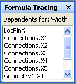

# À propos de la fenêtre Suivi des formulesAbout the Formula Tracing Window

La fenêtre **Suivi des formules** est conçue pour fournir aux développeurs de formes avec des informations sur les interdépendances entre des cellules — à la fois des cellules dépendantes (qui ont une dépendance sur une cellule donnée) et des cellules précédentes (qui dépend d’une cellule donnée).The **Formula Tracing** window is designed to provide shape developers with information about cell interdependencies—both dependent cells (cells that have a dependency on a given cell), and precedent cells (cells that a given cell depends on). 
  
Les cellules dans un Microsoft Visio ShapeSheet contiennent des formules et les valeurs.The cells in a Microsoft Visio ShapeSheet contain values and formulas. Formules peuvent, à son tour, avoir des références à d’autres cellules, la puissance pour calculer une valeur dans une cellule en fonction de la valeur d’une autre cellule.Formulas can, in turn, have references to other cells, giving you the power to calculate a value in one cell based on another cell's value. Lors de la création ou la gestion des formes complexes, toutefois, il peut être difficile à identifier toutes ces interdépendances car une formule peut faire référence à n’importe quelle cellule dans le dessin, qu’il s’agisse d’une cellule dans la même feuille ShapeSheet ou une cellule appartenant à un autre objet dans le dessin, par exemple, une page, style, master ou une autre forme.When creating or maintaining complex shapes, however, it can be difficult to identify all these interdependencies because a formula can reference any cell in the drawing, whether it's a cell in the same ShapeSheet, or a cell belonging to another object in the drawing, for example, a page, style, master, or another shape. 
  
La fenêtre **Suivi des formules** fournit des informations pour vous aider à comprendre les implications des changements opérés sur les cellules.The **Formula Tracing** window provides information to help you understand the implications of changes you make to cells. 
  
## Afficher la fenêtre suivi des formulesDisplaying the Formula Tracing Window

Pour afficher la fenêtre **Suivi des formules** , avec la fenêtre ShapeSheet active, sous **Outils feuille ShapeSheet** dans le ** conception ** onglet, dans le groupe **Suivi des formules** , cliquez sur **Afficher la fenêtre**.To view the **Formula Tracing** window, with the ShapeSheet window active, under **ShapeSheet Tools** on the ** Design ** tab, in the **Formula Tracing** group, click **Show Window**. La fenêtre **Suivi des formules** apparaît fixe par défaut dans la fenêtre feuille ShapeSheet, mais est une fenêtre ancrée qui peut être fixe, flottante ou fusionnée avec d’autres fenêtres ShapeSheet ancrées disponibles, par exemple, la fenêtre **Explorateur de styles** .The **Formula Tracing** window appears docked in the ShapeSheet window by default, but is an anchored window that can be docked, floated or merged with other available anchored ShapeSheet windows, for example, the **Style Explorer** window. 
  
## Cellules Tracing dependentTracing dependent cells

Pour une liste des cellules dépendantes d’une cellule en particulier, sélectionnez cette cellule dans la fenêtre ShapeSheet. Dans cet exemple, la cellule Width est sélectionnée.To see a list of cells that are dependent on a particular cell, select that cell in the ShapeSheet window. In this example, the Width cell is selected. 
  

  
Pour afficher ses cellules dépendantes, dans le groupe **Suivi des formules**, cliquez sur **Repérer les dépendants**.To view its dependent cells, in the **Formula Tracing**group, click **Trace Dependents**.
  
Une liste de toutes les cellules avec une dépendance sur la cellule Width apparaît dans la fenêtre **Suivi des formules** .A list of all the cells with a dependency on the Width cell appears in the **Formula Tracing** window. Vous pouvez accéder à n’importe quelle cellule dans la liste en double-cliquant sur son entrée dans la fenêtre **Suivi des formules** .You can navigate to any cell in the list by double-clicking its entry in the **Formula Tracing** window. 
  

  
## Suivi des cellules precendentTracing precendent cells

Pour une liste des cellules dont une cellule en particulier est dépendante, sélectionnez d’abord la cellule dans la fenêtre ShapeSheet. Dans cet exemple, Ia cellule Geometry1.X2 est sélectionnée.To see a list of cells that a particular cell is dependent upon, first select the cell in the ShapeSheet window. In this example, the Geometry1.X2 cell is selected. 
  

  
Pour afficher ses cellules dépendantes, dans le groupe **Suivi des formules**, cliquez sur **Repérer les antécédents**.To view its precedent cells, in the **Formula Tracing**group, click **Trace Precedents**.
  
Une liste de toutes les cellules dont dépend la cellule Geometry1.X2 apparaît dans la fenêtre **Suivi des formules** .A list of all the cells that the Geometry1.X2 cell is dependent upon appears in the **Formula Tracing** window. Vous pouvez accéder à n’importe quelle cellule dans la liste en double-cliquant sur son entrée dans la fenêtre **Suivi des formules** .You can navigate to any cell in the list by double-clicking its entry in the **Formula Tracing** window. 
  

  

